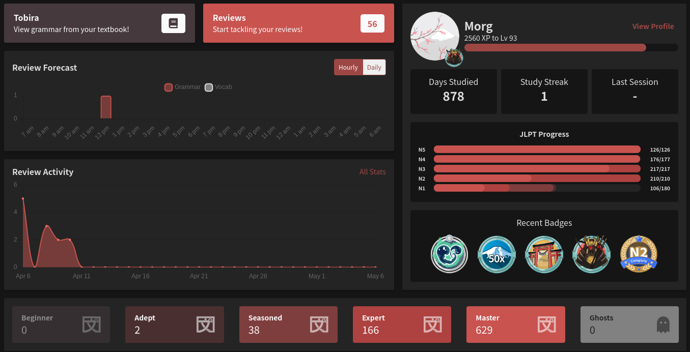
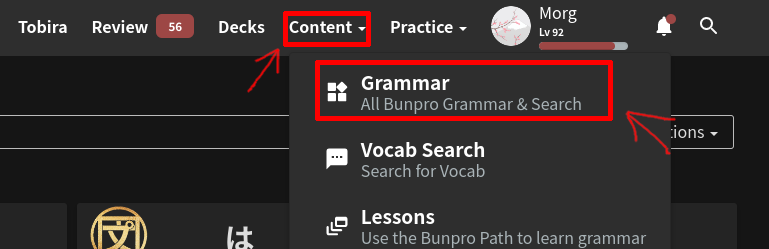
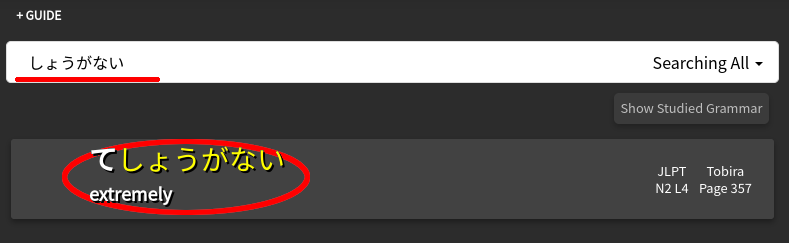

# Fitting Bunpro in your study routine

[Bunpro](https://bunpro.jp) can be both a very powerful tool and a very useless/overrated/pointless
one depending on how one approaches it.

Personally speaking, as is for everything that pertains [[5e00df06]] and
language studying in general, there is no one true way that fits everyone.
However, I think it's useful to write a few words on how I personally approach
it. Bunpro can be a great companion to leverage from and should not be
easily dismissed.

Disclaimer: **Bunpro is a paid service**. I firmly believe that paying money is
not required to learn Japanese (or any language), however sometimes it can make
your life easier.

<!-- TODO: write a piece on paying for language learning -->

## Not a study tool

To some people, this might be obvious, however it needs to be said: **Bunpro
is not a grammar study tool**. All it does is provide you with grammar points
with very **very** minor one-sentence explanations (if anything) and a bunch of
example sentences. It is not meant to be used as a way to study the grammar
itself. You have other methods (see: [[a1b59e45]]) to do that. Use bunpro for
what it is: **a SRS tool** similar to [[6cfc2b98]].

## Stats and Goal tracking

This is not for everyone, but some people are really into stat tracking, graphs,
and overall goal tracking. Having your eyes on the prize, you look at how much
you have achieved and how much there is still to grind. As you slowly add new
grammar and acquire new knowledge, you get to see how far you've gone and that
can be a great source of motivation.

As you can see from the picture below, Bunpro can provide all of that quite
nicely and I think it's fun to look at.

It also keeps track of various gamification things like streaks and
achievements/badges.

### A note on JLPT progress

I do not plan to take the [[[6adb84e3]]] and I have no interest in anything that
pertains to it. **However**, for people who do, Bunpro is pretty great at
showing you all the grammar in a list sorted by JLPT levels and can give you a
nice and clear path towards making sure you are up-to-speed with whichever
JLPT level you are currently targeting.

Just note that some of the higher levels (N2 and mostly N1) might still be
missing some grammar and are still actively being worked on by the Bunpro team,
so make sure you aren't missing some of that if you're studying for the N1!

## Grammar mining - Howto

Grammar mining is a process similar to vocabulary/sentence mining for the
[[6cfc2b98]] world.

While normally you would be looking up words and building your anki cards for
each new I+1 sentence to add to your shiny deck, for grammar you have an easier
path than that, if you use bunpro.

Bunpro has a great way to manually add individual grammar points as you come
across them, as shown below. Click on **Grammar** menu, and then **ALL**:

In the next list page, click on the **Hide Studied Grammar** button, to hide
all the grammar you already have in your reviews.

Type in the search field what grammar point you want to look up, then click on
the results (if any).

Review the new grammar, look at example sentences, and once you think you're
ready, simply add it to your reviews clicking on the button at the bottom.

That's it. This grammar will now start appearing in your review sessions for you
to learn it properly.

## Leverage your textbooks

There are a few commonly used textbooks (Genki, Tobira, etc) that are supported
as *paths* on Bunpro. You can access them by clicking on the appropriate button
as per the below picture.

If you are using any of these textbooks in your studies, you can just follow
each chapter in order and as you complete them, add the specific grammar points
to your reviews. It's a great way to stay on top of your textbook material and
still be drilled regularly on it SRS-style.

## Integrate Bunpro in your Loop

As per the [[58465ab9]], once you start iterating on step 2 and consume native
material every day, that's where Bunpro really shines.

Simply follow these steps and you cannot go wrong:

 1) Consume native material
 2) Find some grammar you do not understand
 3) Search for it on the [master reference](https://itazuraneko.neocities.org/grammar/masterreference.html)
    (more on this in [[a1b59e45]])
 4) Read the explanation
 5) **Mine the grammar** (see above)
 6) Add it to your reviews
 7) Go back to step 1

That's all there is to it.

**Note**: Bunpro sometimes has a weird/interesting notion of what *grammar* is.
You might stumble upon some words or phrases that are not in the master
reference but are still part of bunpro. I'd advise to mine them anyway as it's
always good to do so.

**Another Note**: The opposite is also true. Sometimes there are points in
grammar that we do not realize have a specific nuance and are a different but
similar-enough to what we already know and we tend to overlook them. In this
case, I like to just browse bunpro's grammar list just to see if I can spot some
points I *think* I know but that I haven't added yet. I'm always surprised at
what I am able to find.
