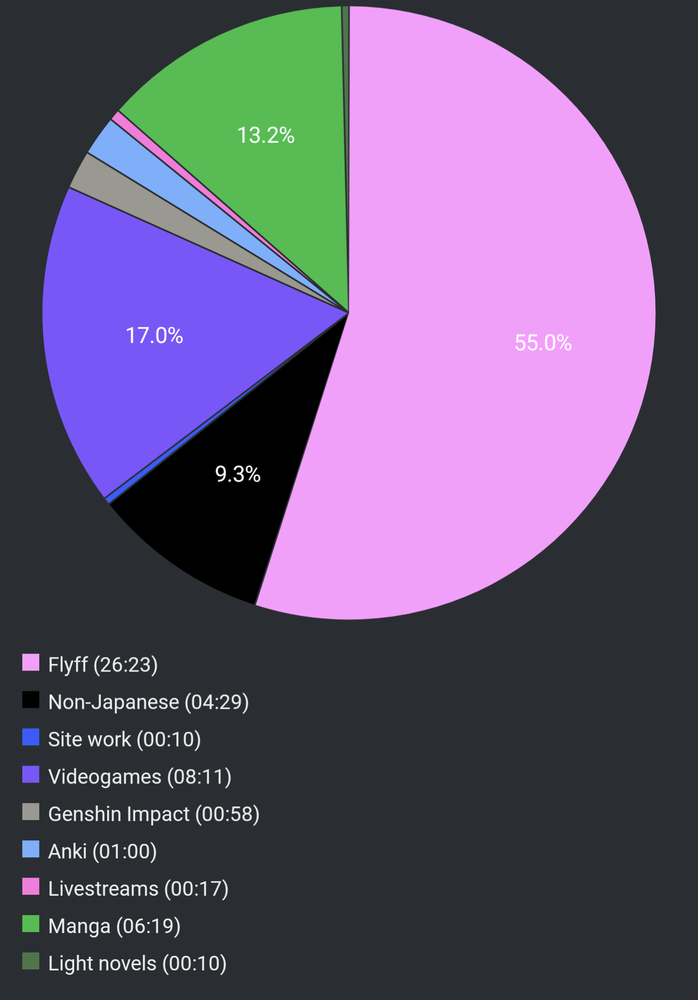

# Report Week 15 May - 21 May 2022

It's been a fruitful week for manga. I ended up buying the first volume of three
series I wanted to try on a whim, so now I've found myself having to finish all
three of them on top of the ones I've already been following. Absolutely zero
regrets.

## Manga

First volume I read is 少年のアビス, which was recommended to me. I really
enjoyed it and I'm looking forward to reading the following 7 (for now) volumes.
The story revolves around a high school student living in the countryside, who's
the fan of a certain idol. He lives in a dysfunctional family and has to support
his senile grandmother, his mother, and his NEET brother who abuses them. One day
he meets the idol of his dreams who for some reason moved to his city and started
working as a conbini clerk. Stuff happens and he ends up having sex with her...
except even more stuff happens but I won't spoil it here. Overall really good,
reminds me of stuff from Asano Inio or Shuzo Oshimi. Very nice.

The second volume I read is from a newly released manga called Beautiful Place.
I'd be lying if I said I understood most of what was going on, because I
definitely didn't. The story seems to revolve around some kind of twisted future
in a Japan torn by civil war. There's groups of highschool girls that participate
in some kind of internal war-like fights. They have their own gang turfs and have
no problem shooting each other to death with guns, bombs, and all kinds of stuff.
It's pretty messed up and uses a lot of difficult military terminology so I had
a hard time following, but overall the flow of the action was really nice so I
still enjoyed it.

The third one is the first volume of a trilogy called 徒花. The story revolves
around a highschool girl called ミヅキ and the murder of her best friend. One
morning, after hearing the report of her best friend's murder on the news, she
goes to the local police and confesses doing it, with proof where her body was
buried and everything. She gets then taken to jail and her lawyer starts asking
her what happened. She recounts a bunch of episodes which seem to have led to
her best friend's murder, however there's something going on behind the scenes
and it's not clear yet exactly what. So far it's a very good detective/murder
story seen from a somewhat original angle. Me likes.

## Pie Chart

Previous entry: [[f0794eca]]
