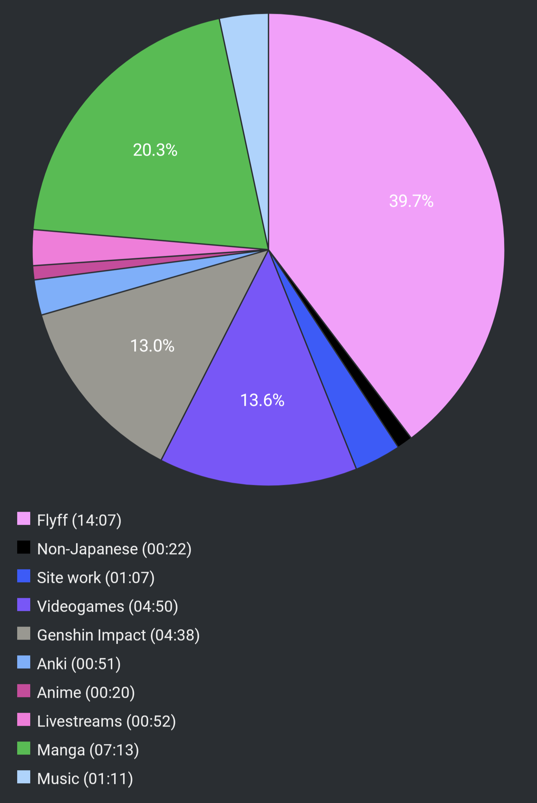

# Report Week 12 Jun - 18 Jun 2022

This week I was finally able to finish some of my leftover stuff. I finished
Strangers of Paradise and caught up with クジラの子らは砂上に歌う to the latest
volume. I actually thought it was the last one but seems like the series is
still continuing although we're near the end.

## Manga

I read from volume 17 up to volume 21 of クジラの子らは砂上に歌う. We left off
with the inhabitants of the 泥クジラ being attacked by an empire ship, most of
the cast captured or in disarray. We get to see some background story and
flashbacks that describe the origin of シュアン's failed power and オウニ's
birth. Things happen and thanks to the power of friendship and シュアン having
a change of heart, he decides to sacrifice himself and get himself assimilated
into the ヌース that is on the empire's enemy ship. By doing so he takes control
of it, while オウニ escapes, and then manages to free オルカ and the other
people that were being kept hostages. A lot of stuff happens and in order for
the 泥クジラ to escape the clutches of the empire ship, オルカ decides to crash
his own ship with the empire ship, causing a huge collision that sinks both of
them into the sand sea, sacrificing himself for the cause.

Our protagonists on the 泥クジラ start drifting uncontrolled in the sea once
again and eventually arrive to a new land full of peaceful and friendly people
that welcome them by calling them the inhabitants of the「死の島」. On the other
side of the world, however, the emperor (who looks exactly like チャクロ)
reveals his plan to take control of the empire's ヌース and sink the entire
continent under the sea killing millions of his own people. After doing so, he
takes the ヌース, who now looks like a giant floating humanoid castle, to go
meet the 泥クジラ and its people.

Stuff happens, and we are once again plunged into a war with the empire, except
the emperor seems to personally know チャクロ, and we get to witness a series of
flashbacks and weird dreams from centuries (if not millennias) before, where
チャクロ re-lives his past lives in the body of other people that look exactly
like him.

It turns out the emperor is a ヌース himself, an "angel" sent by the Gods on
earth to destroy humankind, and centuries prior he befriended a previous
incarnation of チャクロ himself. We discover that the world revolves around the
relationship between those who record history (記録係) and those tasked to
protect those records. A lot of characters in the story are just re-incarnations
of people that existed in the past. And the emperor himself, whose true name is
スキア, has vowed to break the loop by becoming the "ultimate" 記録係 and
recreate the world in such a way where humans can just be emotionless puppets
under his control and experience "true happiness" that way.

Volume 21 ends as he takes control of チャクロ's body and fuses together his own
ヌース mothership with the 泥クジラ, and starts the apocalypse that is called
カタクリュスモス. Yes, a lot of Evangelion vibes, I'm loving it.

## Videogames

On the topic of wacky world-changing time-travel shenanigans, the story
of Strangers of Paradise ended on a very similar note. I never played the
original Final Fantasy game (maybe I should), but this game provides an
explanation for some plot holes and unanswered questions about that game's
ending (allegedly).

We find out that Jack, the protagonist, has been set up to repeat the same
experiment over and over again in some kind of simulated "world" by a race of
superior "enlightened" humans trying to harness the power of chaos. For every
warrior of light, there must be a "warrior of dark" to bring forth chaos and
taint the crystals that are used to generate and then purify energy continuously.

The story is quite complicated, but at the end it boils down to Jack concocting
a plan in one of his former iterations to break free of the loop, and then get
his memories erased. And the game itself is us playing through this iteration
while being unaware that we are setting ourselves up for our own failure.

In the end, Jack Garland (wink wink) fails and gives in to chaos, and by doing
so sets in motion his plan to break out of the "simulation", free the world of
Cornelia, and teleports himself back thousand years into the past to become the
"evil" Garland with his four f(r)iends. Then, a thousand years later, as the
warriors of light are brought up to defeat him, the events of the real Final
Fantasy begin. Garland set himself up for failure all along, to save the world.

## Pie Chart

Previous entry: [[cd262d04]]
