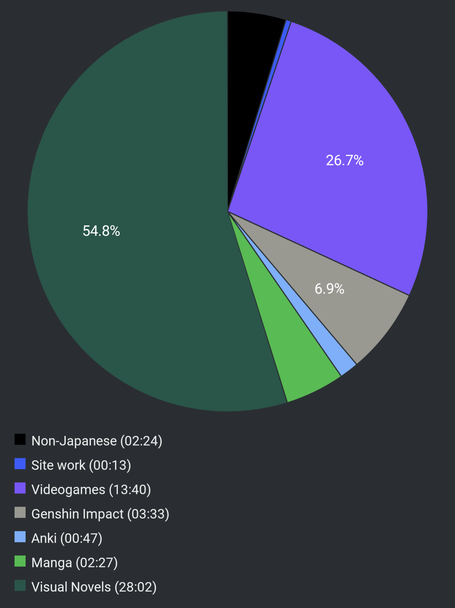

# Report Week 24 Apr - 30 Apr 2022

Still haven't gotten the courage to go back to my book this week, I've been
hooked on a lot of other random stuff though, which is pretty nice. Mostly I've
been devouring the YU-NO VN, but there's also a bit of videogames and manga here
and there.

## Videogames

I bought STRANGER OF PARADISE FINAL FANTASY ORIGIN and it's been pretty damn
fun so far. I think I'm about halfway through the story although the story
itself feels still completely random and very uh... unusual. I was a bit
disappointed that the famous "bullshit" cutscene in Japanese is actually a bit
more neutral in feeling (but still very random). The game throws at you A LOT of
jobs with a lot of skills to pick and match. On top of that, there's A LOT LOT
of gear upgrades to pick, to disassemble, to examine, etc. It's very confusing
and I'm still mostly just button mashing and "equip best gear" but once I reach
endgame I imagine I'll have to spend more time choosing stuff carefully.

## Visual Novels

I literally cannot stop playing YU-NO. It's just too good. There's almost 0
fluff or filler content. The story is engaging, the characters are complex and
interesting, and the general aura of mystery that never leaves you just stops me
from putting down the game. I NEED to finish this, it's insane how much I've
read this week thanks to this. It also helped me practice speedreading and
skimming through some cutscenes which is something I haven't really done much in
the past in Japanese.

I've completed the first two routes (Mitsuki and Ayumi), and I'm now on my way
to completing Mio's route. The interesting part is that in each route you kinda
just get a glimpse of what is really going on but you don't get the full picture.
Each character has their own sub-story and you get glimpses into other routes but
you can't fully grasp it until you have played all of them. I'm excited to get
to the end of it.

## Manga

The new chapter (19) of ニューノーマル came out this week so I gave it some of
my time. We are introduced to a new character who becomes friend with Natsuki.
Just like Natsuki she's also somewhat of a "pervert" and is interested in the
pre-pandemic culture of "maskless" movies. I got the feeling she's going to
become yet another piece of the classic drama/harem vibes that the MC gives off.
Speaking of which, we haven't seen pretty much none of him in this chapter so
that's a bit of a shame.

For last, I've also read through the 20th volume of EDENS ZERO. The story is as
light hearted and fun adventure as ever (minus the sad bits), so there's not
really much to comment on. One thing that annoys me however is that right off
the bat we are met with a 3 year timeskip, and that to me feels like a very lazy
plot device from the author. In common shounen fashion our characters now have a
bunch of new completely unexplained abilities to show off. I wish we'd actually
have seen them train or whatnot to be able to obtain them but oh well... a bit
of a disappointment.

## Pie Chart

Previous entry: [[2339047d]]
