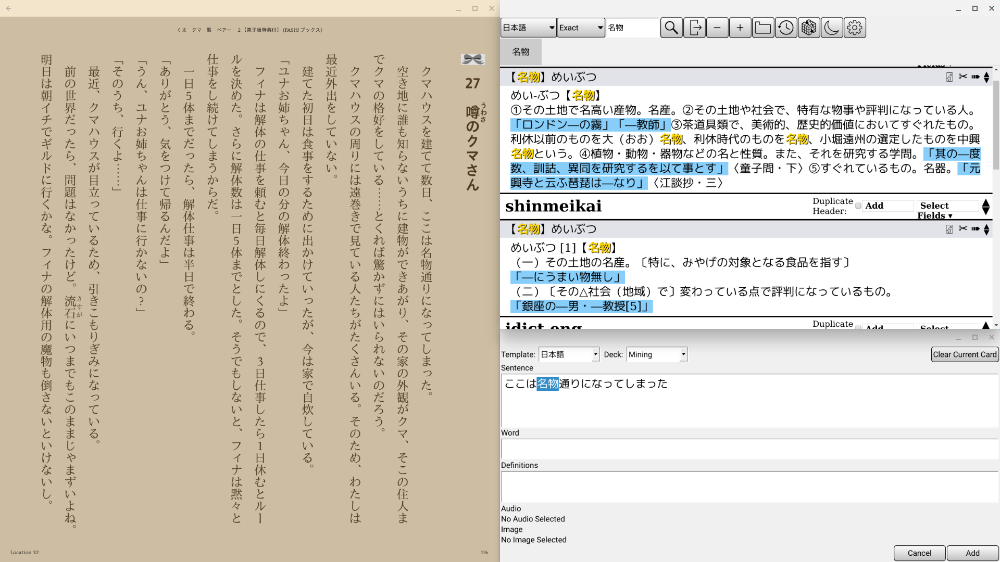

# Installing Anki on a Chromebook

Chromebooks are surprisingly decent machines to do some light hacking and also
to study and practice Japanese on the side.

The time I spend mining for cards and doing reviews with [[6cfc2b98]] these days
is evenly split between my Windows PC and my Chromebook. However, when setting
up my workflow for the first time I found the resources about Anki on ChromeOS
to be quite lacking, so I decided to write something about it.

## Prerequisites

You will need a Chromebook that supports [Linux Apps](https://wiki.archlinux.org/index.php/Chrome_OS_devices/Crostini).

## Installation Steps

First off, we need to differentiate if you are running on amd64 or arm, run
the following command: `uname -a`

If you see some text with `x86_64` (example: `Linux penguin 5.4.58-07649-ge120df5deade #1 SMP PREEMPT Wed Aug 26 04:56:33 PDT 2020 x86_64 GNU/Linux`)
then you need to follow **both** Step 1 **and** Step 2.

If you don't see that and see instead `arm` or something similar, then you need
to stop at Step 1 since the Anki project does not offer arm-compiled binaries
to install. You will have to use an older version from Debian.

### Step 1) Debian (old) Anki version from repositories:

 * Launch the Linux Apps terminal
 * Run the following command: `sudo apt-get update && sudo apt-get intall anki`
   * If it asks for permissions or confirmation, just hit yes

Now you should have an oudated version of anki with all its dependencies running
on your machine.

### Step 2) More recent stable releases from the official project

However you are not done yet. We need to download the actual
useful latest stable version of anki from their site and install it on top
of the default one.

 * Go to [the releases page](https://github.com/ankitects/anki/releases/) and
   download the `linux-amd64.tar.bz2` file of the version you want.
 * run `tar xjf <file>` on the tar.bz2 file you just downloaded
 * run `sudo make install` in the folder you just extracted

And you're done! Enjoy your new Anki.

## Installing add-ons

Add-ons work like everywhere else, however if you want to locate your add-ons
directory to install custom ones, they are located at:

`~/.local/share/Anki2/addons21/`

## Getting sound/audio clips to work

You will need to install either `mpv` or `mplayer` to get audio clips in your
cards to work:

`sudo apt-get install mpv`

## Troubleshooting

### Anki does not start with the error "qt: Could not initialize GLX"

This seems to be a problem related to arm Qt libraries not supporting OpenGL
rendering.

Run the following before launching Anki:

`export QT_XCB_GL_INTEGRATION=none`

## Running Android apps side by side

The great advantage of Chromebooks is that you can run Android apps side by
side with your anki setup to get easier card mining. For example the following
picture is running the kindle Android app with my card mining set up on the
side:

