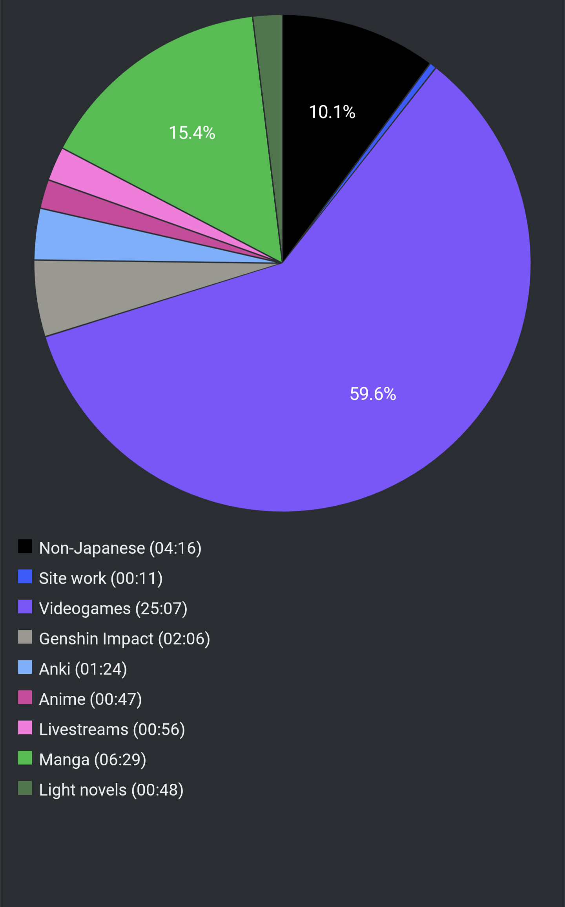

# Report Week 03 Apr - 09 Apr 2022

New week, new report. This time around I feel like my seasonal interests have
started moving towards manga again as I haven't spent much time with 鹿の王
(I do feel a bit guilty honestly).

## Videogames

As usual, spent a lot of time playing games, more than I'd have wanted. Lots of
Apex Legends which doesn't really count much for Japanese immersion but it is in
Japanese at least.

I've been continuing with my playthrough of Scarlet Nexus although I'm still
relatively early on. There's been a very big "oh fuck" reveal which I won't
spoil but ever since then I've been getting hooked more and more on the game's
story. Maybe the anime tropes are a bit too strong but heh, what can you do.

## Manga

Brand new entry for this week is manga. I've picked up クジラの子らは砂上に歌う
again, it's been probably over a year since I had put it on hiatus due to other
interests but the story is still as intriguing as ever. I read volume 7 and 8
both this week and it's been a pleasure. At the end of volume 7 we got some
window into a side story that I thought was totally unrelated but it turns out
it connects with the worldbuilding and some events happening in volume 8 so it
wasn't a total waste of time. Both volume 7 and 8 have been very heavy on
flashbacks and general exposition digging into the background of some very
important characters. We found out the origins of オウニ and the general illness
that plagues the inhabitants of the 泥クジラ. On top of that we even learned
about some of the deeper motives of one of the big baddies and why he behaves
like that (might not be a baddie after all? who knows). At the end of volume 8
it seems like we've finally reached new lands so volume 9 will be very exciting.

I've also gotten the new release for おかえりアリス (volume 4) and... oh wow,
what a great manga. It touches a lot of very touchy subjects like queerness and
transgender issues, depicted by the distorted reality filter of its author (as
is typical) plus a(n) (in)sane dose of teenage drama and existential angst. I'm
looking forward to reading the next volume once it comes out, I can't wait.

## Pie Chart

Next entry: [[f67bc935]]

Previous entry: [[fd7f220a]]

