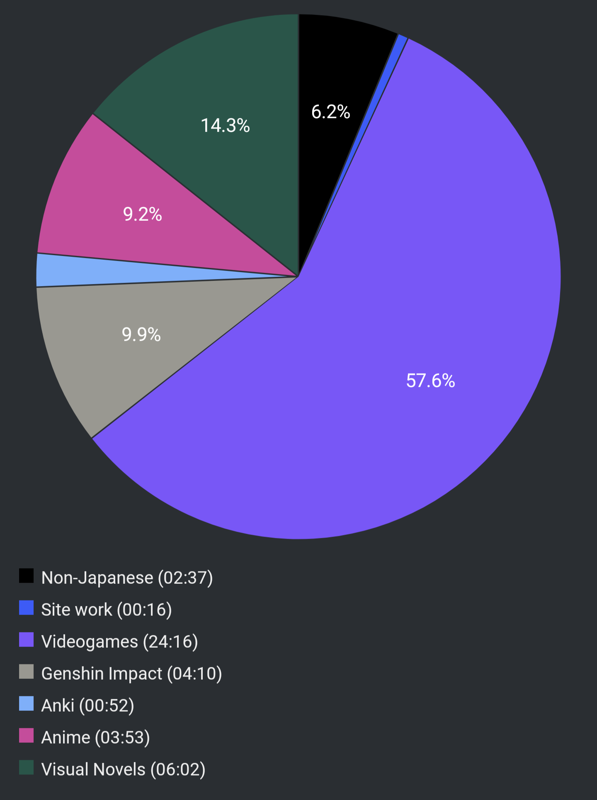

# Report Week 17 Apr - 23 Apr 2022

I actually didn't get to do a lot of reading immersion this week, no particular
reason, just didn't feel like it I guess. Continuing with the theme of last week
I've been playing some more VNs and I got into the mood of a more
point-and-click style so I started playing この世の果てで恋を唄う少女YU-NO.
Besides that, lots of Apex Legends and I caught up with some anime which took
quite a bit of time off me. I finally finished 平家物語 and boy, was it was
*hard*, but still really really good even though I only understood like 20%,
30% at most, of it.

## Visual Novels

I continued with Robotics;Notes, but still not much. As I said last week the
story so far is really boring and I find it hard to break through the filler
grind to get through the good parts (as is typical of VNs with me).

On top of that, my main focus is この世の果てで恋を唄う少女YU-NO and wow what a
great start. I only played through the prologue and it's already got me hooked.
Aside the lewd/jokester comments of the main character which go from "cringe" to
"okay that's actually funny", the rest of the cast is also quite varied and
interesting. In the prologue there's not much focus on the main mechanic of the
game and it only introduces you to the game's world and characters, but already
I can feel the draw towards the mystical and pseudo-sci-fi themes of it. We take
the role of 有馬たくや, a highschooler with a really troubled life. His father
has recently remarried to a woman that is barely a few years older than his
son, and then unexpectedly passed away. So now たくや is left with this new
"mother". He does not remember much of his birth mother, and never had a good
relationship with his dad either. Other figures in his life are his school
counselor/school nurse who likes to smoke on the rooftop and has a very rough
(but friendly) attitude, a former teacher who seems to have some relation with
his father, the headmaster of the school who's an old friend of his father (but
also very shady and is hiding something), a lively 後輩 from his former club who
follows him around everywhere, a stereotypical tsundere お嬢さん, and a
mysterious new transfer student we bump into a few times in the prologue but
never really talk to much.

The prologue ends as we get introduced to the main mechanic of the game: jumping
"world lines" (or timelines?) using some weird device our father has left us
before disappearing and we find out that our father might actually not be dead
after all! What a twist.

Apparently this game was the OG multi-route VN and literally spawned the genre
itself, which is quite impressive. Using this time/world leap device we can
save "states" using certain gems at certain branching points in the story and
we can go back and forth to follow different routes with different outcomes.

I'm actually excited to see how it will play out and I hope I can stick to it
for a while at least, since it seems fun.

## Pie Chart

Next entry: [[12cd517e]]

Previous entry: [[f67bc935]]
