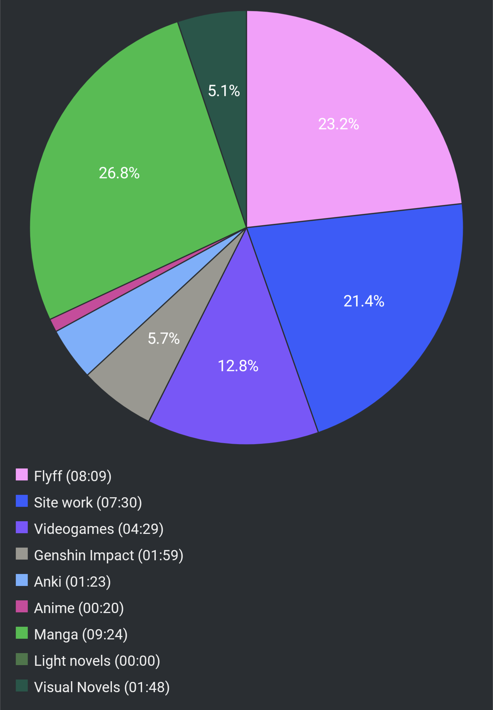

# Report Week 26 Jun - 02 Jul 2022

Lots of varied content this week as well, which I'm pretty happy about.

## Manga

We start with the 10th volume of 新米姉妹のふたりごはん. I hadn't read this
manga in a while and a new volume just came out. It used to be my beginner manga
and it's still nice to read today. In this volume as always we get a lot of
delicious cooking recipes with some yuri step-sister undertones. We got a bit of
a glimpse of the future of サチ and あやり, with the former becoming a
photograph apprentice to her father, and the latter training under a french chef
in her school.

I also read volume 21 of EDENS ZERO. We get to meet post-timeskip ラビリア which
seems to have lost her knack as a b-cuber and resents Rebecca for it. The two
have some kind of cat fight and surprisingly ラビリア seems to hold her own in
combat (totally out of the blue) and is later brought on board of the EZ as a
guest. Hmm I wonder if she'll be joining the rest of the main crew... classic.

Moving on to more interesting manga, I was finally able to tackle some of Asano
Inio's content: 勇者たち and 世界の終わりと夜明け前. They've been on my shelf
for years but I wasn't confident in my Japanese to be able to read them then.
The first is a seemingly nonsensical manga about the deconstruction of the hero
genre. Our group of totally random and ridiculous heroes have finally defeated
the lord of the dark. Except every chapter plays out in almost exactly the same
way, and at the end one of the "heroes" succumbs to the darkness and turns into
the new lord of the dark. Rinse and repeat. It's hard to describe but it's quite
a treat. The other one is a collection of semi-related/semi-unrelated short
stories that mostly focus on themes like coming of age, the bleak outlook of
adult life, the bittersweet nostalgia of somebody coming back to their inaka
town after living in tokyo, general melancholy and suicidal thoughts of a man
whose family life is unhappy, cheating, depravity, and all kinds of other
stuff. The beginning feels a bit boring but the more you read, the more the
depressed and mundane life draws you in and by the end you can't but feel quite
somber about the entire experience.

## Visual Novels

I also started reading 穢翼のユースティア again. When I stopped last time I had
just started the second "arc" of the novel, but got distracted by other things.
Now I feel like my Japanese has improved enough that I can more casually read it
without having to use external aids like textractor, and that's really nice.

In this arc, we see カイム get dragged into some turf conflict between the group
of men that are in charge of keeping the order in the brothel quarters, and a
competing mafia group led by a certain ベルナド who's been spreading drugs and
other bad shit around their area. カイム gets invited by his boss to work as a
secret body guard for him, while he goes to meet "someone" in the upper quarters
who's also trying to get rid of the drugs being spread among the nobles. This
certain someone turns out to be ルキウス, who's a noble knight (?) that has a
certain aura of quite the "bad" guy (but we don't know yet). The two groups
ally with each other to try and oppose ベルナド and... we'll see how that goes.

## Pie Chart

Previous entry: [[ef6b0a14]]

