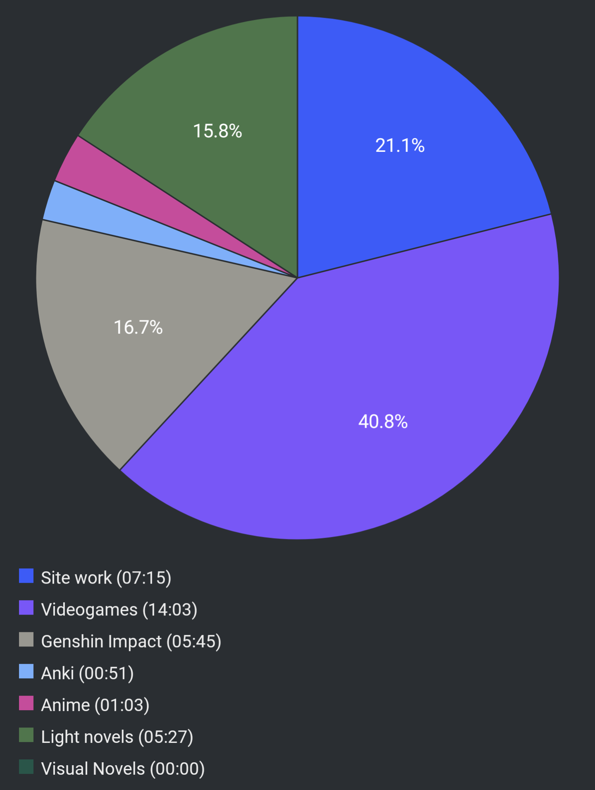

#  Report Week 07 Aug - 13 Aug 2022

## Light Novels

I finally started reading 鹿の王 once again, back from where I last left off for
what feels like half a year by now. Last time I got stunlocked by reading
a lot of politicky worldbuilding infodump between the various warring countries,
empire, rebellion, and a bunch of the important people from the "enemy" side of
the story. That part was really boring and probably the reason why I stopped
reading it.

Now that I'm picking it up again, I went from like 55% of the volume up to 80%
read, and now the story is getting more and more interesting. We see two sides
of the struggle, on the one hand we have ヴァン who's an escaped slave and
former head of a rebellion force against the empire. On the other hand we have
マコウカン who's the guard/aide of ホッサル who's some kind of saint/priest/medic
and who's looking into the disappearance of the slaves and the pandemic that hit
them. マコウカン and the gang followed a local tracker guy who introduces them
to one of the best hunter/trackers of the area, a woman named サエ. She manages
to find traces of ヴァン who escaped and they start to follow him through the
forest. Some stuff happens, time has passed, his trail has gone cold, but they
find leads that take them to a certain merchant who allegedly has been giving
ヴァン a place to stay during the winter at his home village up in the mountains.
マコウカン and サエ alone start a huge treck with their deer (called トナカイ)
mounts going deeper and deeper into the winter mountains. They get attacked by
a group of demon-ish mountain wolves and while fending from the attack サエ
falls into a ravine/river and disappears.

Then the scene changes to ヴァン and his story with the little kid he picked up
from the slave mine. They got taken in by the clan/family of the merchant he
saved in the forest (who had a leg wound) and we get a bit of exposition about
the lifestyle of these clans living in the valley between the mountains. The
book goes into great detail explaining the winter customs and how each family
prepares for it (so-called 冬支度). It also goes in detail about the differences
between トナカイ and 飛鹿 deers, and how ヴァン is an expert in herding 飛鹿.

The chapter ends with ヴァン getting some weird symptoms and reacting to certain
things like some of those deers would, which makes me think it might have to do
with him being bitten by one of those wolves carriers of the plague in the
beginning, and it might explain the title of the book as he might be turning (?)
into a deer or something like that. We'll see. So far I'm hooked again.

## Videogames

I continued playing Xenoblade 3. This game is absolutely massive. I've been
doing a lot of side quests (although I skipped a lot of dialogue  cause most of
it is filler trash and there's too much of it). I'm almost 50 hours into it, and
I'm probably not even halfway through the story. We've had some pretty huge plot
twists. Childhood friends that were supposed to be dead are actually part of the
big enemy gang. Some characters central to the story/plot that died, and a
general feeling of desperation as time is ticking while our main party is
getting unjustly persecuted and pursued by the 執政官 (big baddies). I hope I
can finish Chapter 4 soon since I heard it's the one with the most filler/side
areas, but after that the story is more linear (and I like linear plot). I spent
way too much time with side character/side hero quests already.

## Pie Chart

Next entry: [[de79ee24]]

Previous entry: [[6690dea2]]
