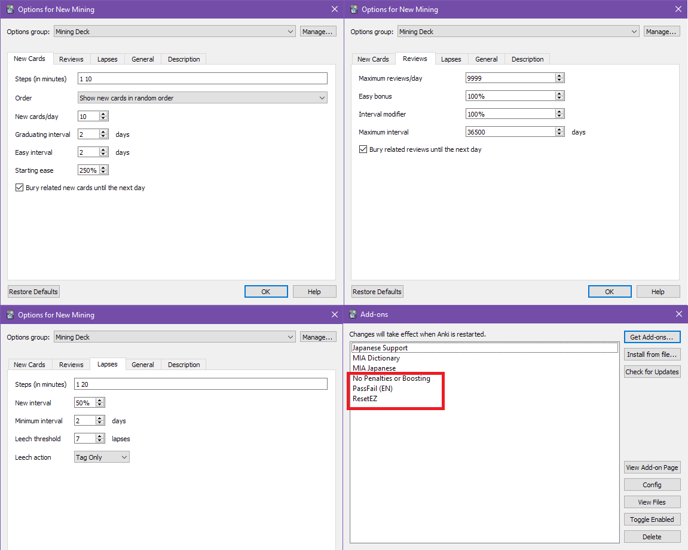

# Better Anki Settings

These are the settings I use for my own Anki setup:

(click on the picture to enlarge)

---

**NOTE:** If you are just now viewing this page for the first time, be warned
that **these Anki settings might not apply to newer versions**. Anki has has
updated some of its algorithms and options, so not all settings and tips in this
page will apply anymore. I am still using [**Anki Version 2.1.22**](https://github.com/ankitects/anki/releases/tag/2.1.22)
and I am happy with it so I don't plan to update it, but if you are using a
newer Anki version just be careful.

If you want some more up-to-date similar setup, you can take a look at the
[Refold Anki Recommended Options Settings](https://refold.la/roadmap/stage-1/a/anki-setup#Recommended-Options-Settings).

---

I have burned out many times in the past with bad/ugly defaults on [[[6cfc2b98]]].

After a lot of looking around, and trial and error, this is what I eventually
settled on and what I feel works best for me.

Anki's defaults can be very merciless when it comes to skipping reviews even if
it's only for a day, and let's face it, who has never skipped a day in their life?

With these improved settings, the experience is more lenient and Anki does not
end up piling up reviews over reviews on you if you skip a few days by accident,
so there's less chance of burning out or being overworked by reviews.

Simply open Anki on your machine, navigate to your deck of choice (either
pre-made, or custom), click on the small cog, and choose "Options".

Input the following:

### New Cards

 * **New Cards/Day**: 10 (This is actually up to your preference, but I don't
     recommend doing more than 20 from personal experience)
 * **Order**: *Show new cards in order they were added* **if you're using a**
   **pre-made deck**, otherwise use the other option for your custom deck
 * **Graduating Interval**: 2 days
 * **Easy Interval**: 2 days
 * **Starting Ease**: 250%
 * **Bury related new cards until the next day**: check

### Reviews

 * **Maximum reviews/day**: 9999
 * **Easy bonus**: 100%
 * **Interval Modifier**: 100%
 * **Maximum Interval**: 36500 days
 * **Bury related reviews until the next day**: check

### Lapses

 * **Steps (in minutes)**: 1 20
 * **New Interval**: 50%
 * **Minimum Interval**: 2 days
 * **Leech threshold**: 7 lapses
 * **Leech action**: Tag Only (this is personal preference, really, but if you
     aren't sure what it is, set it like this)

## Add-Ons (For Anki version 2.1)

To make Anki really shine, you need to get the **No Penalties or Boosting**,
**PassFail**, and **ResetEZ** add-ons. They can all three be downloaded
[here](https://www.mediafire.com/file/lzm3qli6bdh2ubw/Low-Key+Anki+2.1.zip).

There's more details and instructions on how to set it all up at [this](https://web.archive.org/web/20200414033301/https://massimmersionapproach.com/table-of-contents/anki/low-key-anki/low-key-anki-summary-and-installation/)
 now defunct [[[4f5f4e00]]] website.

## Anki mobile?

Unfortunately, Anki on mobile is a bit of a pain because it is not as extensible
with Add-Ons as the desktop version. With the *ResetEZ* Add-On, you might be
able to fix some issues that the mobile version defaults as (mostly for card
related penalties). Just make sure you log onto the desktop version every day
after doing your reviews on mobile, so it fixes the penalties and intervals...
or so I was told. I have never tried it myself as I don't use Anki on mobile.
In general I recommend sticking to PC/desktop if you can.
