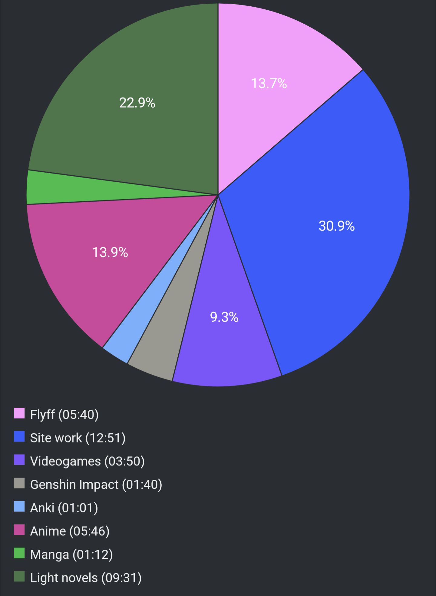

# Report Week 17 Jul - 23 Jul 2022

## Light Novels

I finished reading the first volume of Slayers. I have to say I'm quite torn
between it being an enjoyable light novel, and feeling like it was really really
bad. On the one hand, I actually enjoyed some parts, some of the gags were
funny and the description of certain things like battles and magic system were
quite detailed (when they weren't completely skipped). On the other hand though,
a lot of the narrative doesn't really hold up very well. The entire story feels
very tropey and inconsistent. The entire closing battle revolves around the
fact that they cannot use black magic (リナ's strong point) against the big boss
because he is **the** dark lord that controls all black magic, and then they end
up defeating him by simply... using black magic but relying on a **different**
dark lord (that was never mentioned before this very moment). It was completely
out of the blue and kinda defeated the whole point of a huge chunk of the story.

After Slayers, I started reading the 9th volume of Kuma Bear. Continuing with
the series, it's quite a breath of fresh air. I'm fairly comfortable with the
language by now, and I barely have to do any dictionary lookup at all, which is
very nice. We conclude the birthday party arc from the previous volume with one
of the side characters getting kidnapped and ユナ going truly berserker for the
first time in the series. She fucks up everyone who slighted her and harmed her
friend and gets back the kidnapped girl. That one was fun. After that, we go
back to the usual shenanigans of cute girls doing cute things while discussing
tasty food recipes (including a whole chapter on how two make rice mochi) and
a whole new array of bear plushies for ユナ's friends.

## Games

I've decided to give Stray a try, since it was free in my PS+ subscription.
While it is not a Japanese game, I've been playing it in Japanese because I'm
too lazy to change the language. The game is nothing special gameplay-wise but
the atmosphere is really nice and the robots are cute. I thought there wouldn't
be a lot of dialogue originally but actually there's quite a bit once you start
talking to all various robots. The translation is... okay-ish. Some stuff
definitely reads like awkward Japanese (a lot of 彼は, 私は, etc), but also it's
hard to say if it's intentionally awkward or not because some parts appear weird
also in English (for example using the "Meet" prompt to talk to robots, which
was translated as 交流する in Japanese, both equally weird).

## Manga

In preparation for the Made in Abyss volume 11 release next week, I went and
re-read volume 10. Last time it felt really hard and with a lot of tricky words
and I feel like I missed out on some finer details of the story. This time
around it went much more smoothly and it only took me around 1 hour to read
it which is quite fast for me: these volumes used to take me 2-3 hours before.
I'm looking forward to next Friday with the new volume release!

## Pie Chart

Previous entry: [[6e2946a6]]

