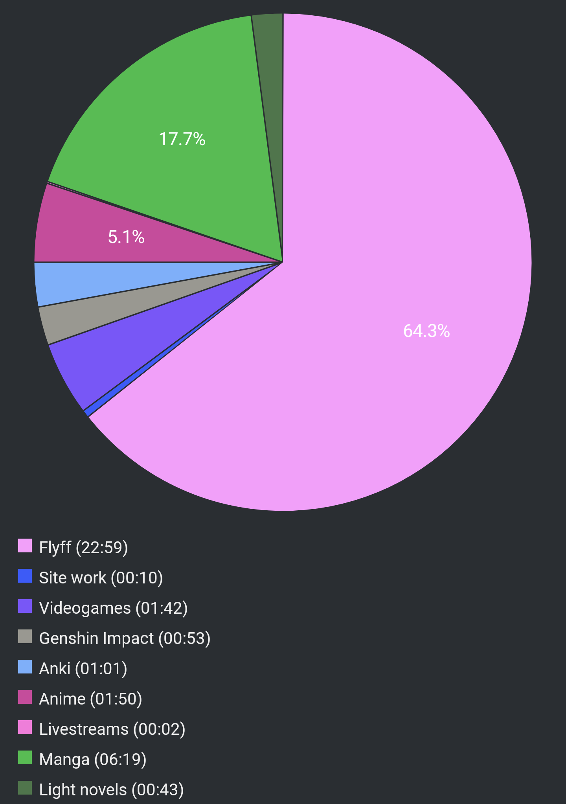

# Report Week 22 May - 28 May 2022

## Manga

This week I continued from where I left off with manga from last week.

I finished all three volumes of 徒花 and I was very pleasantly surprised by its
development because just by reading the first volume I was totally not expecting
how it ended up playing out. I don't want to spoil much but all I'll say is that
by the first volume we get to hear the "full" story of the main character's best
friend's murder (by the hands of said main character). And then we find out that
basically a lot of it was fabricated. We start volume 2 with the story told from
the point of view of the murdered girl and we get to explore the various
circumstances that led to her murder. We get to see the real motive behind the
main character and how the whole crime played out. I can imagine some people
might not appreciate how the story ends cause there are a few things kinda left
in a "but this is not fair!" kinda tone but for me personally I really enjoyed
the dark gritty realism of all of it. A solid entry in my bookmeter for sure.

Next, I continued with 少年のアビス. I bought the next 3 volumes (total 4 I've
read so far) and devoured them. All I'll say about this is what a fucking
clusterfuck of shit. I absolutely love it. The whole story has massive vibes of
the kind of small town mentality drama where everyone knows everyone else and
everybody absolutely fucking hates the place they live in and their
circumstances but for a variety of reasons they also cannot leave. Little by
little we get to explore various relationships between many characters all
intertwined with the main character, and for every one of them the main
character keeps getting more and more fucked. Now I am starting to understand
the true meaning of the title. Also, somehow, everyone just wants to kill
themselves. Go figure. I can't wait to read more of it, I'm gonna have to buy
the other volumes now.

## Pie Chart

Next entry: [[a0b120f0]]

Previous entry: [[0f327a6c]]
