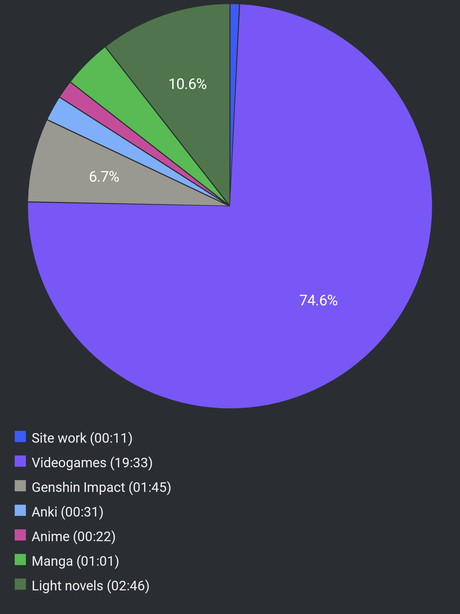

#  Report Week 31 Jul - 06 Aug 2022

## Light Novels

I finally finished reading volume 9 of Kuma Bear, although I still have a couple
of side stories/chapters left. I think overall it was a pretty good volume,
however the ending fell a bit flat. I mean, I'm not really expecting high level
literature anyway, but we basically got a taste of typical cutesy stuff even
when the story was about to get interesting. Yuna is tasked to help her elf
friend in recovering her family heirloom that she sold to a merchant. The
merchant tells her he can't give it back unless she manages to go get a precious
painting from across the river, in the other town's store. She pulls off some
kuma shenanigans (walking over water lmao) and manages to get it in time. Due to
some trading shenanigans next, she meets another rich man trader's niece who is
super into her kuma book. Yuna decides to give her her picture book for free,
and also a couple of the new kuma plushies she made. In exchange to thank her,
the rich merchant gifts her an old abandoned house where she can set up her kuma
portal (classic). The volume closes with our elf party resuming their trip
towards the elf village. I really hope volume 10 will have some more exciting
stuff happening, because the elf village sounds cool.

## Manga

I finished reading Volume 11 of Made in Abyss that I had started last week.
Right as the story started to get very interesting, the volume ended. Guess I'll
have to wait for another year for volume 12 to come out... I'm not a fan of
flashbacks and background stories, and half of volume 11 felt it had that vibe.
We get to meet some unknown black whistles delving down to the last dive. Riko
and her party meet the corpse of one of them, and manage to loot a few rare
artifacts including a brand new arm for Reg. Continuing through the 6th layer
we get to see some more black whistles who are under a new white whistle we've
never seen before. That's where the volume ends. There's interesting references
all around, but they open up more questions than they answer, honestly. The one
thing that stood out the most to me is that for the first time (I think?) we
hear a reference to the 7th layer and there seems to be an implication that it's
the last one? We'll see in a few years if the pace keeps up like this.

## Videogames

Xenoblade 3. Xenoblade 3. Xenoblade 3! That's pretty much 90% of my reading time
this week. The game is absolutely amazing, and the story has me really hooked.
So far I'm only up to chapter 4, but if I had to relate it to any other media or
story, it really reminds me a lot of Darling in the Franxx. There's some serious
implications that the main characters are all disposable clones, and that the
big baddies are somewhat involved in some kind of planetary 900IQ chess game
with each other, while sucking out the life energy of their pawns. I still don't
know the reason why this is happening, and it's unclear yet if there's some
implication of time travel or not yet, however I got the feeling that all will
converge with our band of heroes trying to break out of this "game" to discover
yet another more terrifying truth about the world. I'm very excited, the game is
a real blast.

## Pie Chart

Next entry: [[2d6374e9]]

Previous entry: [[fff095f2]]
