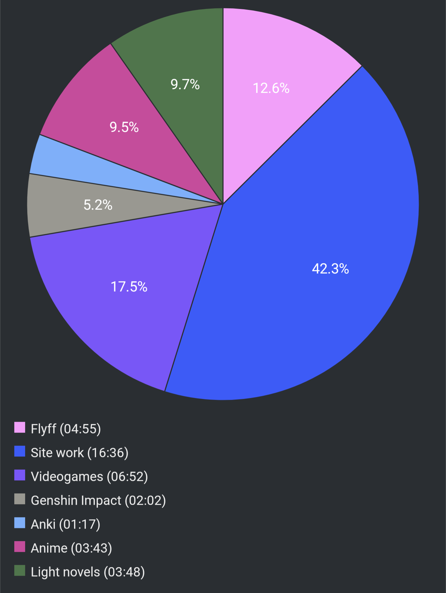

# Report Week 10 Jul - 16 Jul 2022

## Light Novels

I continued reading Slayers a bit, not as much as I'd have wanted but I am about
60% into the first volume which I guess is decent progress. I've gotten used to
the weird writing style and it's not as bad as it was in the beginning, although
it still feels like a cheap mash of old anime tropes. After a bunch of filler
"world setting" scenes in the beginning which felt very abrupt, now our heroes
are actually plunged into a proper story with somewhat of a plot. We learn that
our heroine リナ got her hands on a statuette, and that two groups of people are
looking for it. There is ゼルガディス which is a shifty-looking fellow that
looks like his skin was made of stone, and who bosses around a bunch of
brigants (including a fish man, a mummy, and a werewolf). Then we meet another
"nice" looking dude called レゾ the red priest. He is also looking for the
statuette, allegedly to stop ゼルガディス from taking it, and prevent the
summoning of the ancient dark lord. From what I recall from watching the anime
two decade ago, I'm pretty sure レゾ is actually the bad guy, but we'll see.

Right now, リナ and ガウリイ have teamed up with レゾ and set up a bait for
ゼルガディス, but something goes wrong and he manages to capture リナ who is now
being tortured by his gang of brigants to get her to tell them where she hid the
statuette.

## Videogames

On the videogames front, I started playing Ys IX on PS5. I have never played a
Ys game before, but so far I am having a lot of fun. There's a lot of background
story and world building that I don't quite get but most of the story is
standalone and isolated, with a few references here and there from the previous
games.

Our hero Adol got himself captured by some guards of a "prison city" due to some
news of his shenanigans from previous games. He says he is innocent but still he
gets thrown in a cell in this inescapable prison. Still, somehow, he manages to
escape but on his way out of some ancient acqueduct place he meets this
mysterious girl who shoots at him with this special gun, and curses him. Long
story short, he becomes a 怪人, a human with some special demonic powers, and is
forced to take place in some arena-like battles with a bunch of monsters while
partying up with a bunch of other strangers who are also 怪人. On top of that,
his curse prevents him (and the others) from escaping the city, so now he is
stuck there while trying to investigate what is going on, who these people
are, and what these mysterious monsters are. Bonus point: when monsters drop
treasure, they drop boxes of items and the box itself is called 匣 (はこ). I had
never seen that kanji before but it's pretty neat.

## Pie Chart

Previous entry: [[c85db3bb]]
