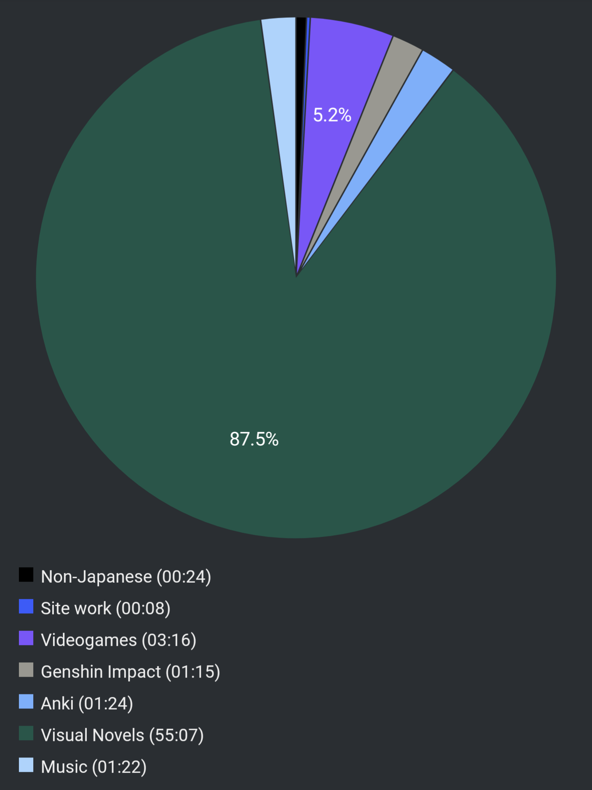

# Report Week 01 May - 7 May 2022

This week has been... really something. I told myself I'd quickly go through
YU-NO so I could spend the rest of Golden Week immersing in some other stuff
but... turns out the VN was WAY longer than I expected (and that's a good
thing).

## Visual Novels

Yep, this week has been full YU-NO (50+ hours), almost non-stop. I finally
managed to finish it yesterday with 100% completion including a few extra
endings but wow, what a ride.

Since last week, I though Mio's route was going to be the most interesting /
enjoyable one since it touched a lot of very specific mysteries that made the
VN interesting for me. I was VERY wrong.

I don't want to spoil too much but I'll just say that what I thought was pretty
much the end of the VN was pretty much just the beginning. After completing all
the routes for all the different girls I thought it'd be over relatively
quickly, however the "true" route actually takes you through a huge mindfuck
rollercoaster and for almost the entire week I simply could not put it down one
second. I'm glad I read this, and I'd recommend it to anyone, really.

On top of this, I just now started playing the first game of the Nonary Games
series. I don't have much of an opinion yet cause I just got through the first
few puzzles but so far it seems interesting. Although after YU-NO I don't think
anything comes even close.

## Videogames

As a bit of side immersion to break out of the post-VN blues mood, I started
playing the first game of the Trails of Cold Steel series. I've played Trails in
the Sky before (in English) and it was moderately enjoyable although very long.
This one so far seems good but also I heard it's going to be incredibly long too,
I don't really expect to stick to it until the end, but we'll see. So far I got
only through the prologue.

## Pie Chart

Next entry: [[f0794eca]]

Previous entry: [[12cd517e]]

