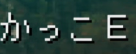

# E as いい

This is pretty straightforward. E sounds like いい so sometimes you'll see it
abbreviated as such. It's always funny when it happens.

Take this example, the word かっこいい is written as かっこE. I've also seen it
written as `(E` because parenthesis = 括弧 = かっこ.
