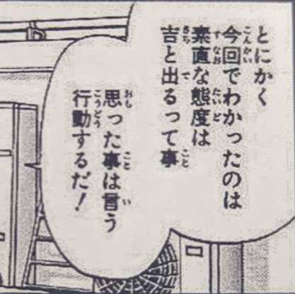

# Omitting こと in a list of actions

This one was really weird the first time I came across it and it was hard to
parse until I asked a native speaker to explain it to me.

Here's the example that saw:

`とにかく今回でわかったのは、素直な態度は吉と出るって事、思った事は言う、行動するだ！`

First of all, this confusing sentence employs another slang technique of
implied quotes (see the だ at the end), but what is very misleading is the way
the sub-phrases 思った事は言う and 行動する are separated.

Here is how the full sentence is broken down:

今回でわかったのは (= the things that I learned this time are...):

 - 素直な態度は吉と出るってこと
 - 思ったことは言う(こと)
 - 行動する(こと)

だ

Basically the speaker is listing 3 actions that he learned, but they are
three somewhat separate clauses that should've been nominalized. It's just
somewhat implied.
