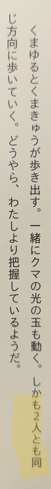
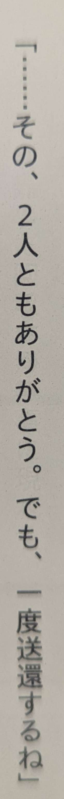

# Use of 二人 not for people

The counter 人 is usually reserved for people. However, it is not uncommon to
sometimes refer to things using 人 as well when you're somewhat personifying
them.

In this particular case, I've often encountered 二人 used to refer to two things
that aren't necessarily people.

This is from クジラの子らは砂上に歌う where the character is talking to a
personified ship and referring to it (+ himself) as 二人.

Likewise, the next two quotes are from くまクマ熊ベアー where the main
character refers to her two bears as 二人とも.

