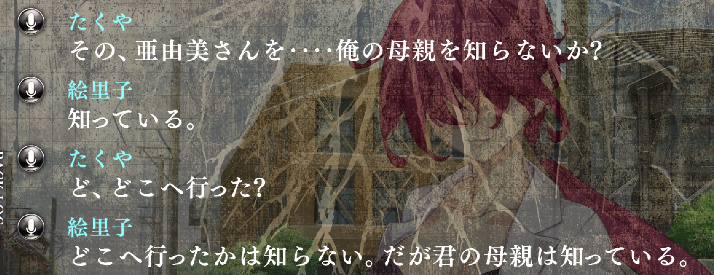

# Use of 知る for the location of things

While the verb 知る means more or less to "know", it is often used colloquially
to simply ask for the location of something.

For example, if you lose your phone somewhere around the house, it's not
uncommon to ask 俺のスマホ、知らない？ just like you'd say "Have you **seen**
my phone?". If you think about it, even in English asking someone if they have
"seen" your phone is a bit weird if taken literally, isn't it?

In this pun from the game YU-NO, the main character is asking if the other
person has seen his mom, and says 俺の母親を知らないか？ ("Have you seen my mother?").
The other character answers yes, but she's only making a pun about knowing her
but not really knowing where she is ("I've seen her. I don't know where she is,
but I have seen her before." if we want to put it into a similar English
equivalent).
