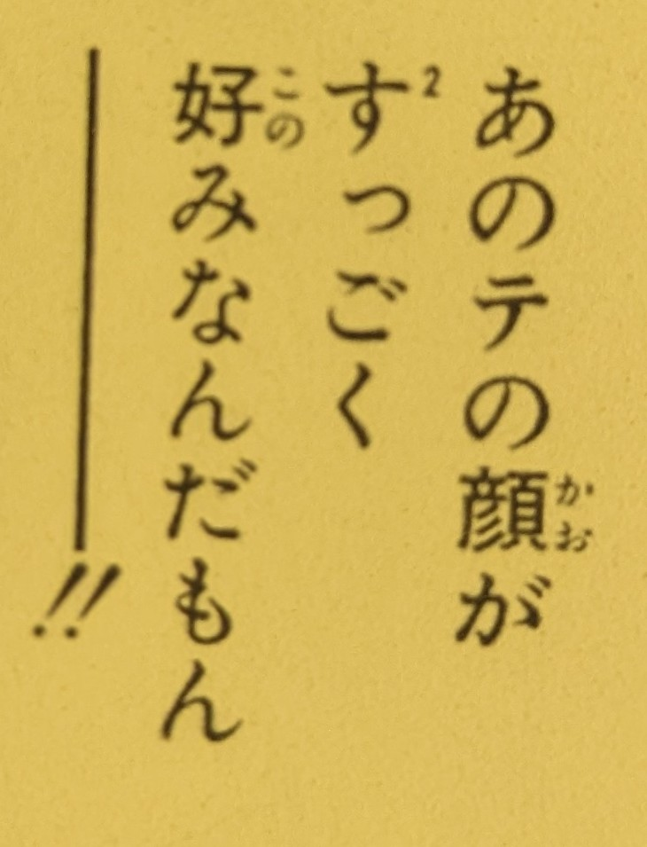
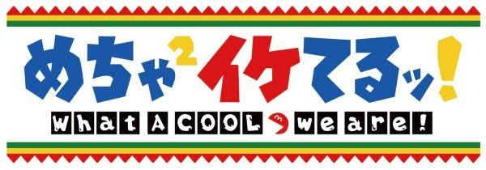

# Using ² to duplicate a word

This is a bit of an old style slang which I think was popular in the late 90s.

There is a ² added to a word to duplicate it. It kinda works like the 々 mark
as slang but for the entire word.

In the following picture for example it means すっごくすっごく:

And in the following one it simply means めちゃめちゃ:

