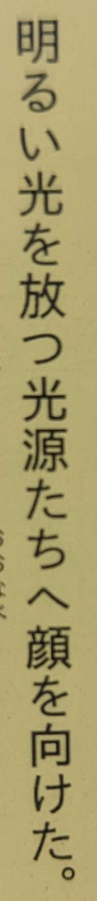

# Using たち as a generic pluralizer

Normally, the suffix たち is reserved for people or for animals/things that are
treated people-like. It has a nuance of pluralization like "X and the others".

Yet, I've seen some authors that seem to like using たち as a general plural
suffix (maybe influenced by western-style prose) even though there's no real
reason to personify or even specify the plurality of the object that it is
attached to.

Here's an example from 槍使いと、黒猫 volume 1:

`明るい光を放つ光源たちへ顔を向けた。`

