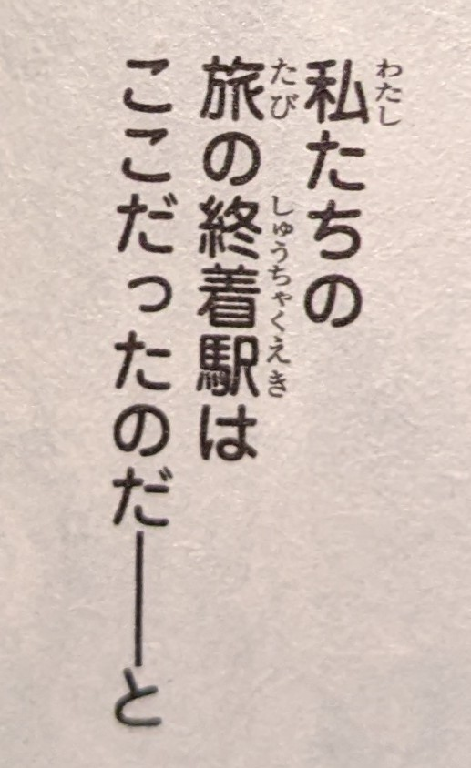

# Using と to leave something implied

Generally, と is used to point at some kind of quote, completed with 思う or
言う or similar verbs. Often, however, the verb itself is omitted when the
meaning is obvious. Sometimes it's not even clear **which** verb it actually is,
but you kinda just know what it is hinting at.

For example, have this great quote from クジラの子らは砂上に歌う

Without the と, the sentence is `私たちの旅の終着駅はここだったのだ` which
roughly translates as "This was the final stop of our journey", but adding the
と at the end implies something like `と思った` which is an addition that makes
it sound like something was going to change that idea. "We thought it was the
end but..." kinda vibes.

The fact that this quote came right at the end of the volume was the cherry on
top as it closed it on a very ominous cliffhanger.

