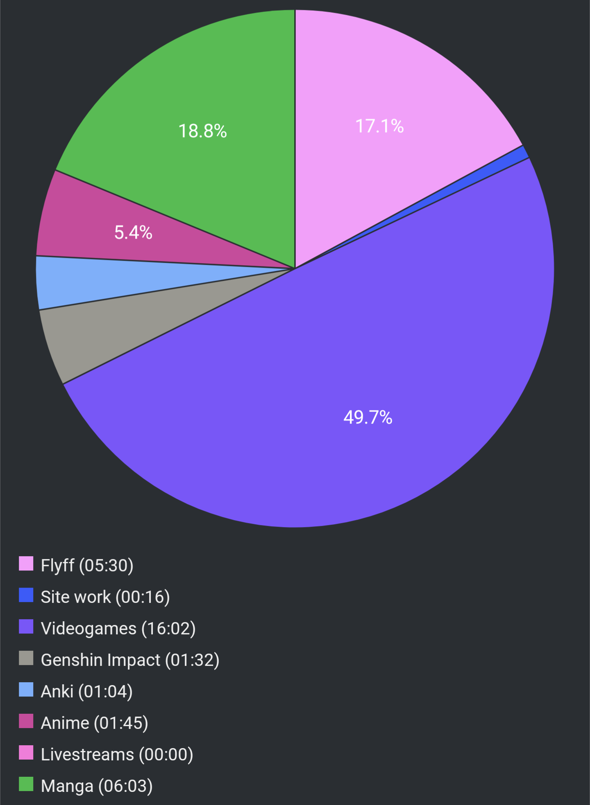

# Report Week 29 May - 04 Jun 2022

I spent this week catching up with some previous stuff I had leftover, which is
nice. Lots of manga and lots of videogames. Plus some new stuff (but nothing of
importance honestly).

## Manga

On the manga side, I've been trying to catch up with クジラの子ら. There's
currently 21 volumes out, and this week I managed to read from volume 13 to 16,
only 5 volumes left, maybe I can get to that next week!

Lots of stuff happened. In volume 13 we see the conclusion of the rescue
operation for スオウ and all the other サイミアなし people by the hand of
チャクロ and the gang. We get some sort of reconciliation between the country of
アモンロギア and the people of the 泥クジラ even going as far as having ロハリト
join them on their journey. On the other hand, both オウニ and リコス got
captured and are now held hostage by オルカ. On オルカ's side, we see him
declare independence from the empire and start his own rebellious navy, with the
purpose of taking over and re-building the world.

The story continues with a bunch of discussion between various people on what
to do, and in the end チャクロ finds himself on a secret expedition with スオウ,
the former 団長, and a bunch of other side characters with the intention of
meeting オルカ to negotiate some deal to get オウニ and リコス back and stop the
war between them. Stuff happens, and they are met with オルカ's lover, イティア
who supports their plan (although reluctantly) and takes them to meet him. On
the way they re-unite with リコス as well.

We spend most of volume 15 in a very interesting conversation between them and
オルカ and the vast majority of the volume is a giant flashback where it turns
out he might not be such a bad guy after all. Some kind of weird unstable
alliance forms, as we start volume 16 with the 泥クジラ being attacked by the
empire and オルカ oddly jumps in to protect them. Volume 16 ends as the battle
is still raging, with various groups fighting and the situation seems very dire.
オルカ is captured but チャクロ and リコス try to save him, while オウニ is with
the former 団長 trying to save スオウ and a bunch of other citizen of the ship.

As an extra, I also read chapter 20 of ニューノーマル which came out last week.
The story as usual progresses very slowly, but we're getting some yuri-like
vibes between 夏木 and the new character (whose name I forget). Fingers crossed
some good stuff will happen :)

## Videogames

Finally I invested some time to catch up with Xenoblade Chronicles 1's DLC. I
heard it was going to be good to play in anticipation of Xenoblade Chronicles 3
coming out next month and that was indeed true. The story follows Shulk and
Melia stranded on a floating island, fighting against some new entity preventing
them to access the old capital (which is now left in abandonment and full of
monsters). This entity called 霧乃王 has also been infecting various monsters on
the island with some "fog" illness that turns them violent. Our party has to go
through all kinds of stuff, sidequests, and things to save the citizens of the
floating island and get back the capital by fighting the 霧乃王. In the end, we
are successful and we see a very touching scene with Melia being crowned as the
new empress. I'm excited to see her make a comeback in Xenoblade 3.

I've also started playing Diablo Immortal and Returnal both in Japanese. Since
they aren't Japanese games originally, I don't have much confidence in how
natural or not the translation might be, but so far it seems decent for both of
them.

## Pie Chart

Next entry: [[cd262d04]]

Previous entry: [[3e6af951]]

