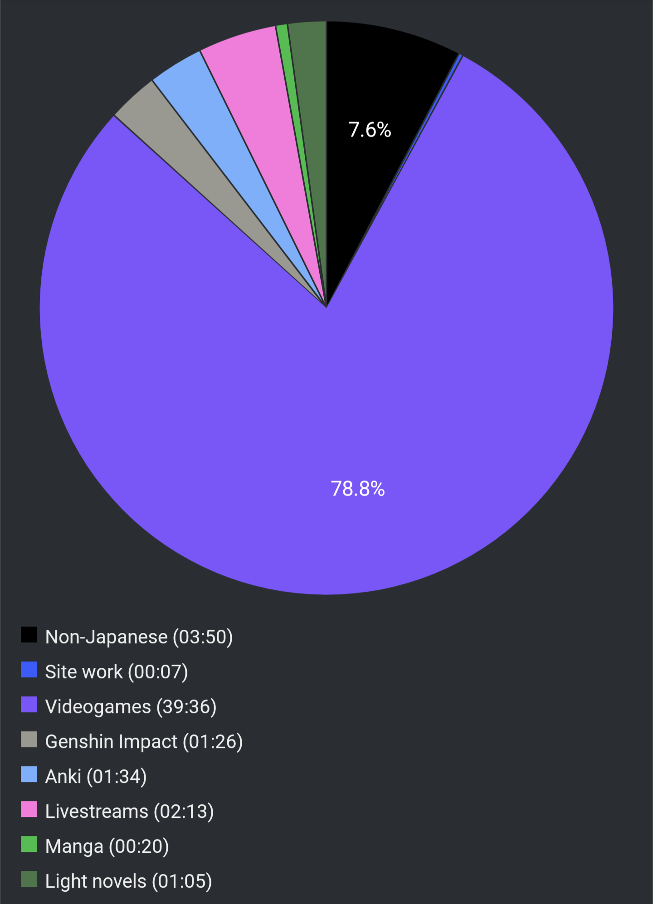

# Report Week 20 Mar - 26 Mar 2022

Same as last week, I spent a bit too much time playing videogames than what I'd
have liked, but it was fun at least.

## Videogames

I've been continuing my Elden Ring playthrough, I'm nearing the end but I'm
still missing some side quests and secondary bosses. Japanese-wise the amount of
dialogue is a bit less because I spend more time exploring but I've been trying
to read item descriptions and stuff more accurately for lore notes which is
kinda nice.

I've also started playing Sin Chronicle, a mobile gacha game, and it has some
kinda interesting story. There's a lot of dialogue/conversation (Visual Novel
style), and there's actual choices that affect the course of the story so I've
gotta stay on the edge and make sure I actually understand what is going on in
the narrative. It also taught me 永劫回帰 as an interesting and rather chuuni
word.

## Light Novels

I'm still grinding away at 鹿の王, not as much progress as I'd have liked
though, Kindle still reports only 23% which means I pretty much only advanced a
measly ~5% since last week. Shame.

## Manga

The 18th chapter of ニューノーマル came out this week, so I've also took my time
to read that. It was quite an emotional one this time around, and as always it
felt way shorter than I would've liked. We got to get closure about a certain
character's fate (death) and the main character seemed to have finally opened up
a bit more with love-interest-1 which was nice.

## Pie Chart

At least it's not 60 hours of Elden Ring anymore, "only" 39... heh.

Previous entry: [[b848081e]]
