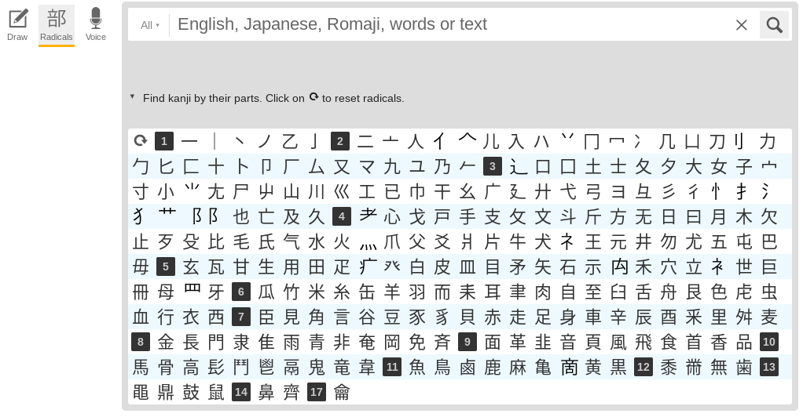
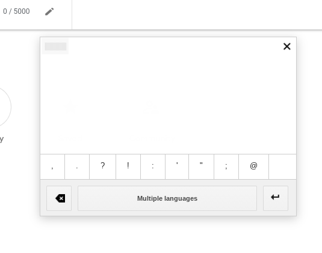

# Methods to Achieve Japanese Learning Independence

As described in [[58465ab9]], achieving learning independence is fundamental to
unlocking language acquisition.

The most important thing is being able to navigate the vast amount of resources
available to you on the Internet without getting lost or incorrect advice.

These are the resources, tools, and steps that I follow whenever I get stumped
by something new in Japanese that I cannot understand.

## What does this word mean?

Check the dictionary:
  - [Jisho](https://jisho.org/) is the best J-E online dictionary available.
  - [Weblio](https://ejje.weblio.jp/) similarly to Jisho, it can often provide
    better and more flexible results. It's definitely worth it to check both.
  - [Goo](https://dictionary.goo.ne.jp/) is a very useful J-J online dictionary.
  - [Nicovideo](https://dic.nicovideo.jp/) has a decent **slang** dictionary.
  - And so does [Pixiv](https://dic.pixiv.net/)

## How do I look up the meaning of this kanji?

 - Go to [Jisho](https://jisho.org) (or use the [mobile app](https://play.google.com/store/apps/details?id=ric.Jsho))
 - Hit the search by radical button to bring up the radicals menu:
  
 - Compose the kanji with the various radicals until it appears in one of the
   listed options.

Alternatively, if you cannot find the kanji on jisho:

 - Go to [Google Translate](https://translate.google.com/)
 - Use the handwriting tool to scribble something that looks similar to the
   kanji you want, and look at the results. Google Translate is quite smart and
   does not care much about accuracy or stroke order.
  

## What is the difference between these two words?

 - Look the two words up in a J-E [dictionary](https://jisho.org)
 - Look up the definitions for both words in a [J-J dictionary](https://dictionary.goo.ne.jp)
   - This is very important because often the J-E dictionary won't be detailed
     enough to point out nuances and slight differences between synonyms
 - Google `「word1」 「word2」 どう違う` and read the (usually) Japanese explanation
 - Use [[7507c939]] to check how the two words differ in context with real
   sentences and usage

## What is the difference between this word written with these two different kanji?

This is what is called an 異字同訓 (ijidoukun).

Aside from following the steps from the question above this one, you can also
look the most common ijidoukun on [this site](http://www.bretmayer.com/ijidokun.html).

## What does this particle or grammar structure mean?

 - Use [Itazuraneko's grammar point aggregate](https://itazuraneko.neocities.org/grammar/masterreference.html)
   to search for the grammar point you are unsure about
 - Search for `「<grammar>」意味` on Google and read the (usually) Japanese results

## What is the counter for this word?

 - Search on google for `<word> 数え方`
 - Look up the word on [benricho](https://www.benricho.org/kazu/)

## How do I pronounce this word?

 - [Forvo](https://forvo.com) is a huge repository of recordings of native
   speakers reading words out loud.
 - [Youglish](https://youglish.com/japanese) is an amazing site that lets you
   search for a word in a youtube video as it is being used in context by a
   (usually) native speaker. It is also a great way to find native listening
   material.
 - [OJAD](http://www.gavo.t.u-tokyo.ac.jp/ojad/eng/pages/home) is an online
   [pitch accent](https://www.youtube.com/watch?v=O6AoilGEers) dictionary for
   Japanese.

## How do I read this word?

 - Use [furigana.info](https://furigana.info/) to find how often a certain word
   is read in a certain way (some words/kanji can be read in multiple ways).
 - Search on google for `<word> 読み方`
