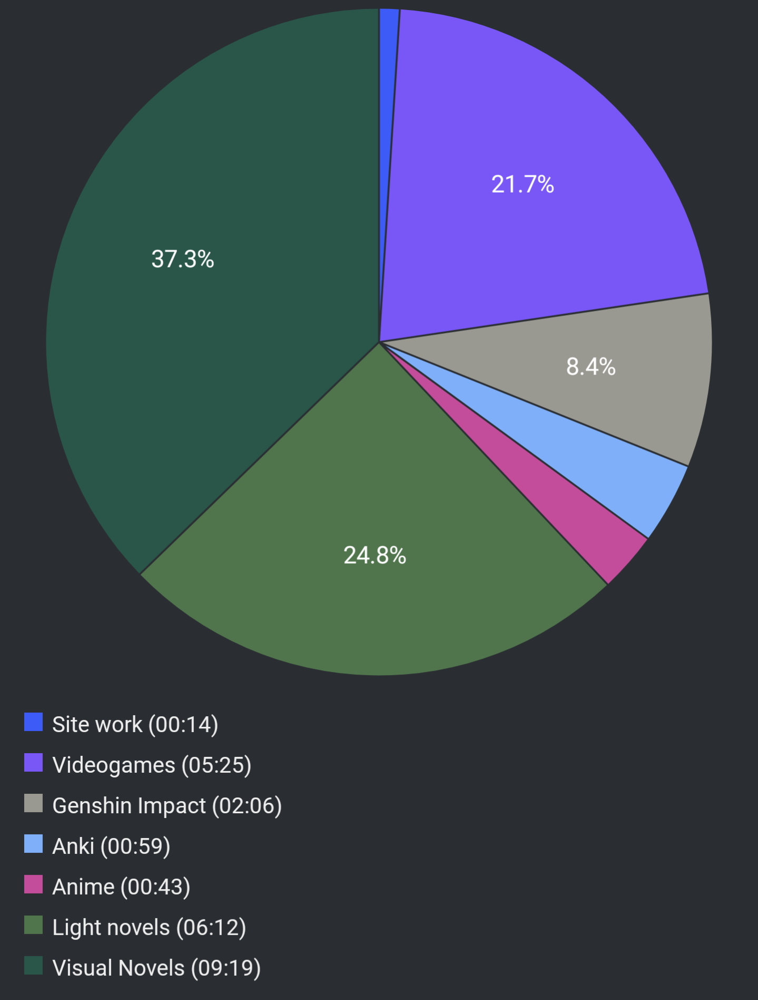

# Report Week 21 Aug - 27 Aug 2022

## Light Novels

To get myself back onto lighter reading, I starter reading the 10th volume of
Kuma Bear. I'm currently about halfway through it and I have to say finally we
get a volume where something actually happens that is mildly interesting (rather
than just random slice of life stuff). Yuna and her two elf friends finally
reach the elf village. We find out that the village is in dire need of help
because the sacred tree has been infected by a parasite and has been weakening
the village barrier and monsters have been coming in causing problems. Yuna
meets with the village elder who's the grandfather of サーニャ (the adventurer
guild leader). We find out that Yuna can "accidentally" understand the elf
language due to isekai cheat superpowers and so she finds out about all the
problems plaguing the sacred tree. She's an outsider so the elves don't really
want to bother her in helping them deal with it (not like they think she could).

However, one day when she's out and about finding a new place to set a new kuma
house (as she does in every new village she visits), she runs into one of the
elf hunters and they get attacked by monsters. She defeats them and then they
get the notice that the village is getting invaded by a bunch of monsters. She
joins to help and the elf hunter vouches for her strength in battle. Stuff
happens and she and the elder get attacked by two cockatrices which are
allegedly very high class monsters, but Yuna manages to dispose of both. After
seeing this, the elder gets a warning that the sacred tree is being invaded by
monsters and as they reach the tree they try to get in but the barrier has been
corrupted and the elves can't enter anymore. By (isekai cheat) coincidence,
however, yuna is able to enter. So she goes in alone and she ends up
singlehandedly defeating all the monsters and then wages battle to the giant
vine parasite monster holding the sacred tree hostage and with some isekai cheat
wind magic and her new mythril kuma dagger she manages to defeat it.

I'm genuinely surprised by the amount of combat and action this volume has.

## Visual Novels

I also decided to quit playing Genshin Impact, and as a treat to myself I ended
up buying the new sci;adv VN: Anonymous;Code.

I'm still relatively at the beginning (chapter 3) but damn this VN is REALLY
good. It takes place in the year 2037/2038, a couple of years after a massive
disaster struck Earth as lots of satellite defense systems went ballistic due to
a bug because of the Y2K36 problem and starteed firing on cities. Places like
Shinjuku have now giant craters in it. Our protagonist is a young hacker whose
father passed away in one of those disasters. He goes around helping people
using his white hat hacker skills with his partner as member of a hacking
group. He runs across this suspicious girl wearing a giant cat (or dog? not sure)
mascot costume asking for his help. Suddenly, they get surrounded by a special
army unit threatening to kill him if he doesn't hand over the girl. Stuff happens
and they escape on his motorbike. As they are about to escape his bike gets
hacked and they get into an accident and the girl gets kidnapped, however our
protagonist finds out his AR implant has a new feature that lets him "save" and
"load" game states (like in a videogame) to turn back time and "fix" things.

More stuff happens and I won't get into too many details but the story is really
packed so far, the tl;dr is that they are now trying to save the world (but we
don't know yet from what). The thing I like the most is that there's a lot of
healthy forth-wall breaking as the main character talks to the player very often
and the save/load features in the game are somewhat part of the story itself
(including the actual UI of the game).

Contrary to other sci;adv games I played (like Robotic;Notes), this one actually
gets into the thick of the story from the get go, so that's already a plus for
me.

## Pie Chart

Previous entry: [[de79ee24]]
