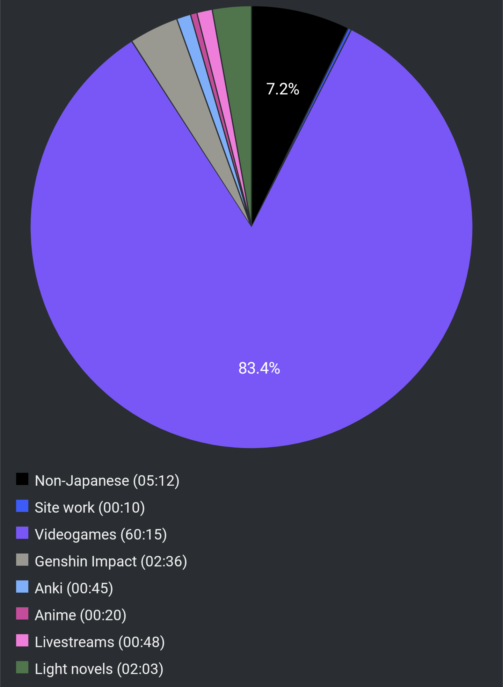

# Report Week 13 Mar - 19 Mar 2022

Today's weekly report is probably going to be shorter. I didn't get to do a lot
of (traditional) reading this week unfortunately. Against any good judgment I
ended up grabbing a copy of Elden Ring and I've been hooked since. Truth be told
I've been playing it in Japanese so at least there's some immersion there, but
not nearly as much as I'd have liked, also because all the voice lines are in
English anyway.

## Videogames

Elden Ring has been crazy fun. I was actually surprised there's so many
difficult words and especially kanji that I had never seen before. The best
example would be 褪せ人 which is the Japanese version of "tarnished". Generally
speaking the game is not hard to follow (also thanks to English voices) but most
item descriptions filter me pretty heavily. And what's even worse, when I try to
look for stuff online on English-speaking communities I never know which is
which. I should hang out in JP communities instead but... oh well.

## Light Novels

I've been fitting a bit of actual book reading at least every night before
falling asleep, as usual. I try to keep active with reading almost every day
even if I have some temporary interest (like videogames) that would take me out
of it normally.

I'm still cracking 鹿の王. I'm still somewhat in the first few chapters (Kindle
says I'm at 18-19% so far), but I'm already hooked. It's developing much faster
than 狐笛のかなた which opened rather slowly. So far our (I assume) protagonist
ヴァン is a slave working in a salt mine (quarry?). One day some wild animals
(dog-like beasts?) attack the quarry and injure the various slaves and guards
there and if I understood it correctly (I admit I'm not 100% sure) some sort of
illness/infection spreads and everyone aside from him dies. He wakes out of the
fever one day, manages to set himself free, and realizes he's the last survivor
of the bunch. Eventually he explores the quarry/slave quarters and meets another
survivor, a young kid/toddler (幼子) and they're on their way to making their
escape from the place before their "owners" come check on wtf is going on.

## Pie Chart

No surprises here, it's Elden Ring all the way. Too much lack of sleep. Oh well.

Previous entry: [[c226ff5e]]
