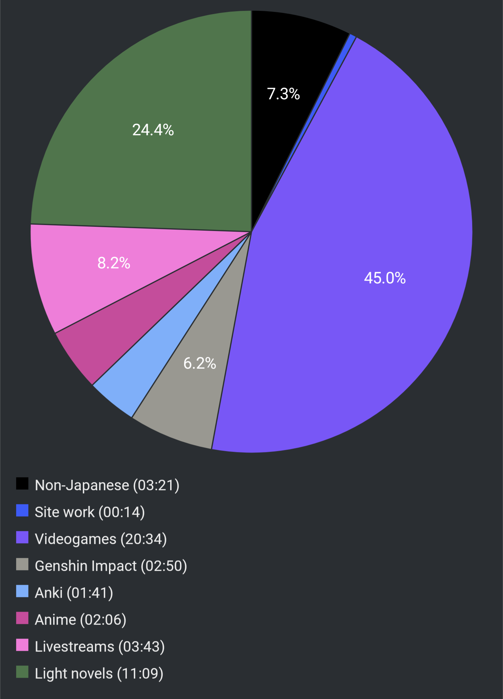

# Report Week 06 Mar - 12 Mar 2022

And we're here at the second reading report! This week was a good one, at least
reading-wise. I had quite some time on my hands although I also feel like I
didn't read as much as I wished. I also got my (3rd) booster shot on Thursday
which kinda left me feeling groggy and meh as heck for a day-ish.

I didn't get to read any manga this week, since I've been focusing a bit more on
light novels and I was reading two of them in parallel (I would not recommend).

## Videogames

As per my previous entry, Triangle Strategy came out last weekend. I continued
playing it a lot actually, although I didn't finish it yet: the game is
**packed** with story and there's so much to read, it's actually crazy (most of
it is voiced too!).

Some people don't seem to like it much cause it feels more like a visual novel
than a tactics game, but I am loving it, maybe even because of that. The story
is really interesting, there's many political intrigues and messy plot twists. I
feel like I never know where it's going to go. Even if there's some conflict
resolution and you think you can take a breather, something more fucked up comes
up and you gotta make some choices between two sub-optimal possibilities.

There's even a part which required proper investigation and questioning a bunch
of NPCs in a specific order. That certainly put to test my understanding of
Japanese and it was some good practice.

## Light Novels

Just like I mentioned last week, I've been reading クマ and SukaSuka, the former
is my guilty reading kind of thing (easy and comfy material) and the latter was
an experiment of audiobook + paper book assisted reading (but almost no vocab
lookup).

I'm glad to say I managed to finish both of them. クマ is... well, it is what it
is, a very comfy volume. Most of it was a lighthearted story about attending a
nobleman's daughter's birthday party with a bit of conspiracy sideplot. Lots of
プリン have been eaten, and ユナ even ended up wearing clothes that weren't her
usual bear suit which was... interesting. I also managed to finish SukaSuka, I
listened to the last chapter at 2x speed as well to train my listening (also I
just wanted to finish it) and it went easier than I expected. The story so far
is still relatively the same as the anime though, so aside from some extra
background exposition, there were not many new things to understand. I plan to
continue to audio-read the rest of the series one day, but it's going to be
lower priority over other stuff in my backlog.

The book I'll be reading next is 鹿の王. There's also the anime movie that came
out some time ago but I'll wait to watch it until I'm done with the series. The
first chapter so far has been going smoothly, although starting a new story is
always a bit of a pain and I'm still getting my bearings, but so far so good.
The author is the same as 狐笛のかなた which I've already read, so there
shouldn't be many surprises there.

## Pie Chart

And now we get to see the first "full week" pie chart, since last week it
tracked only a few days. A lot of this videogame time is not only Triangle
Strategy, to be honest, I played a bit of Apex Legends too...

Next entry: [[b848081e]]

Previous entry: [[f4c00dc5]]

