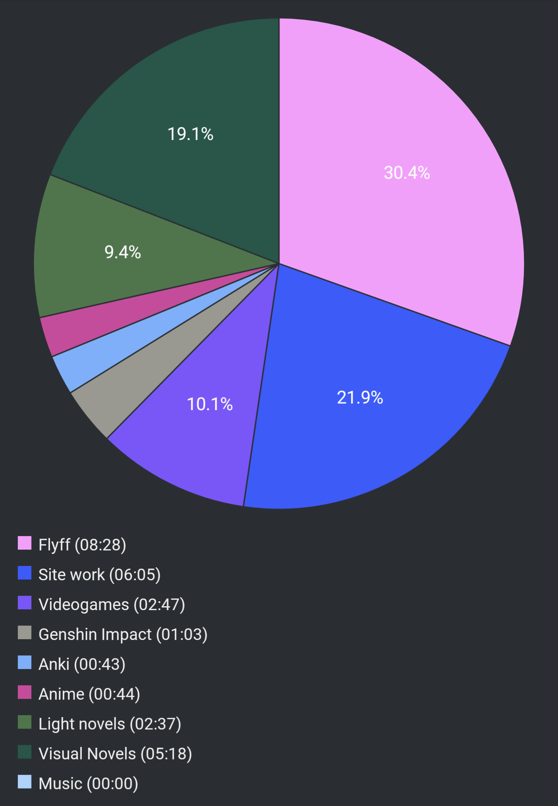

# Report Week 03 Jul - 09 Jul 2022

## Visual Novels

I continued to play 穢翼のユースティア. While the plot is converging around the
illegal selling of drugs by ベルナド and the power struggle between the ベルナド
and ジーク factions, we see カイム start living together with エリス. We get to
explore some of the history between カイム and エリス, how it turns out he was
the assassin that killed her parents, how she got sold into slavery, and how he
saved her to atone for his sins. But she doesn't know this, and as a consequence
she now loves him but he doesn't want to have her around because she should be
"left free". We get to see some drama between them, and エリス suffers some kind
of psychological trauma that affects her behaviour and makes her revert to her
past "lifeless"/hopeless self. カイム now is trying to figure out how he can
save her again from herself, without revealing her about his past.

On the other side, we see カイム and ジーク get attacked by some ベルナド people
and in a following scene we see ベルナド as カイム to become his ally and betray
his friend and mentor ジーク. He seems to hint of knowing about カイム's and
エリス's relationship and implies that if カイム doesn't ally with him, he might
spill the beans to her. This arc is getting spicy.

## Light Novels

I also started a new novel, despite not having finished 鹿の王 yet: Slayers.
I remember watching this anime a lot as a kid, and I liked the worldbuilding and
story, so on a whim I bought the first volume and started reading. I'm a bout
25% into the book and... it's honestly not that great. It reads like a very
cheap and badly written light novel. There's a lot of corny and odd gags that
remind me of 90s anime (I mean.. that's what it is really) which I don't think
work well in written form, especially in this day and age. Also the writing
style is pretty weird and I encountered a couple of phrases that sounded odd or
with incorrect/bad Japanese (as confirmed by native speakers). I'll power
through it but I'm not convinced, I hope it will get better.

## Pie Chart

Previous entry: [[2555157b]]
