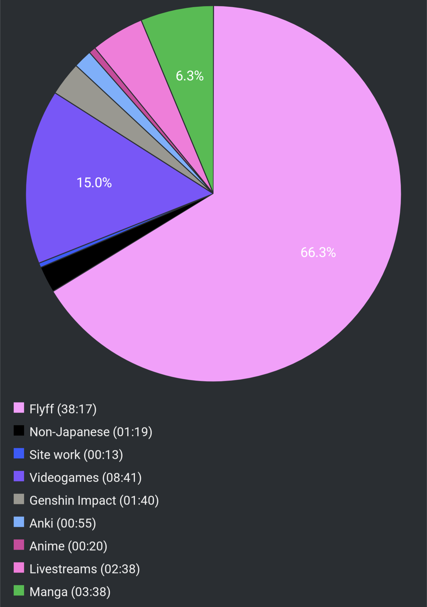

# Report Week 05 Jun - 11 Jun 2022

Not a lot of reading was had this week unfortunately. I spent most of my time
playing non-Japanese games (but with Japanese friends) and watched some streams
and anime. Anyway, a tiny bit of reading was had though, so not all was wasted.

## Manga

I read volume 5, 6, and 7 of 少年のアビス. Last time we left off with 柴沢先生
stalking 令児 and チャコ to a net-cafe. Due to a bunch of stuff that happened,
she gets jealous and decides to fuck everyone and everything up by telling
チャコ's school about her relationship with 令児. This obviously is very bad,
and her parents find out and all sorts of stuff happens and even more drama
ensues.

On top of that, she decides to threaten/intimidate 令児's mother and buy her son
with money. His mother doesn't take it well, and confides with 玄, 令児's friend
and bully, who tells her everything. He tells her about 令児 knowing her secret
(that she meets in secret with 玄's dad for sexual acts, that 令児 tried to kill
himself, that he and チャコ want to escape to Tokyo, etc). She freaks out and
tells 玄 to go "deal" with 柴沢先生 on her behalf.

To make things worse, we get to find out some more about the murky past of
似非森先生 and his relationship with 令児's mother. 令児 himself is starting to
think that 似非森 might be his father. We get a few flashback chapters detailing
the story of their childhood troubles. After that, shit happens and we get to a
point where 令児's mother offers to do a double suicide (心中) together. She
grabs a knife and tries to stab him and herself, he starts bleeding and she runs
outside of the house where 柴沢先生 "accidentally" runs her over and 玄 comes
in to save 令児.

More shit happens, 令児 is now in the hospital, and 似非森先生 comes to visit
him and drops a huge reveal: it turns out he asked 令児's mom to do a double
suicide with him as kids, and she refused. She said she wanted to bear a child
and do that with him instead (or something along those lines). The extremely
cursed mentality of 似非森先生 had him bear this grudge for decades, until the
point where he intentionally brought ナギ to that town to introduce her to 令児
so they would suicide together and ruin his mother's plans.

Long story short, everyone in this cursed place is completely fucked up. We get
to see even more backstories for 玄, 令児's adoptive father, the abuse he got as
a kid, and the general mood of the town. Basically, everyone wants to leave, but
nobody can manage to because they keep coming back. I'm getting some
Silent Hill vibes from all of this. It's a very recurring, if not central, theme
in the series. 田舎 life is ちょっと scary...

## Pie Chart

Previous entry: [[a0b120f0]]
