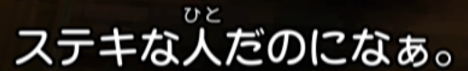
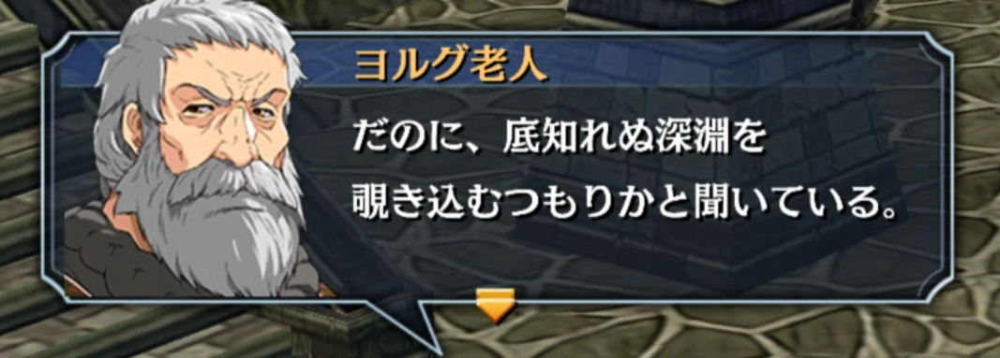

# だのに instead of なのに

This is even on [jisho](https://jisho.org/search/%E3%81%A0%E3%81%AE%E3%81%AB)
but basically certain types of characters (especially old rough men? not 100%
sure) will sometimes use だのに instead of なのに as typical fictional role
language. It might even show up in certain dialectal-sounding accents in media.

Here's two examples:

