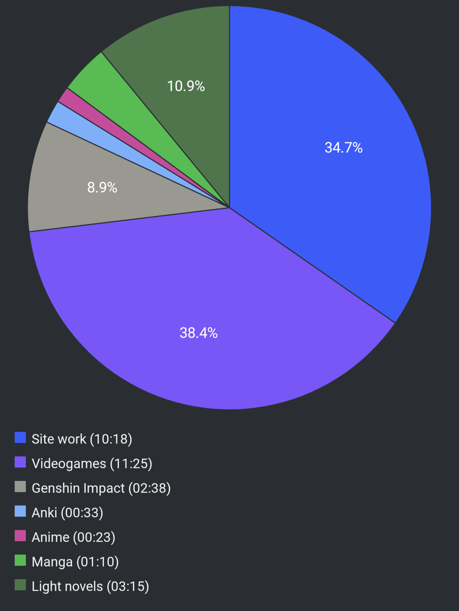

#  Report Week 14 Aug - 20 Aug 2022

## Light Novels

I finally finished 鹿の王 volume 1, after something like 6 months. I have to say
that I'm not impressed. I feel like the story moved very little (although there
are 4 other books), it was mostly focused on worldbuilding, some politicky
stuff between various countries, populations, clans, and a lot of explanations
about how to care for the different species of deers etc. Kinda weird honestly.

Since last week, we basically get to see the passing of a whole year in the
timespan of a couple of pages, after the main character ヴァン spends like
multiple chapters describing the mating patterns of deers and the livelihood of
the people of the オキ village. He basically says "time passed and it was winter
again" and that's how the chapter cuts (more or less). Then we are brought back
to the point of view of the "baddies" with マコウカン again guarding ホッサル
during a falconry match between アカファ王 and a representative of the empire.
We have no idea what happened the year prior after we left him after being
attacked by the black dogs, and there's only one tiny mention of it, like they
completely forgot for an entire year they were supposed to be chasing ヴァン.
Anyhow, the book ends after a whole chapter of politicky talk and then they get
attacked by the black dogs. To be continued in Volume 2, however I'm not sure
I'll read it yet.

## Manga

I read chapter 23 of ニューノーマル. As usual, an extremely short (monthly)
episode. This time we see 夏木 rushing past the armed guards and trying to break
in to save her friend from being infected by the maskless dudes. The guards even
shoot at her (but miss). Kinda the first time we see some real action and the
story getting "serious". Eventually, the police breaks into the gathering and
arrests everyone involved, including 夏木 and her friend whose name I keep
forgetting.

I also read the latest volume (22) of クジラの子らは砂上に歌う. The story keeps
getting better and better. We get the 泥クジラ merged with the empire's ヌース
into what is the prophesized サナタス. Our main cast is split either inside the
mud whale (absorbed), or outside trying to escape the slaughter. Some people
inside manage to escape and even rescue リコス's brother who everyone thought
was dead. They then organize a plan to save the rest of the people trapped
inside while チャクロ has been merged with スキア trying to kill all humans and
recreate the world. チャクロ rebels and manages to stall for time so the rest
can run and devise the plan to lead the サナタス into a volcano-like place that
is supposed to kill it.

As they split in different teams, they managed to break back inside and rescue
チャクロ who is about to kill スキア but at the very last second the crazy
jester guy that was with them whose name I forget steals him back and merges
with it to become the ultimate "god" to destroy the world. As they lose control
of the サナタス once again, リコス's brother who's outside with the rest of the
refugees is facing some kind of monster that was spawned by the サナタス. In
order to save the others, he (seems to?) give his life and defeats the monster.
The volume ends on this scene, redeeming one of the big baddies of the initial
story who has now turned into a good guy. I'm looking forward to the next
volume.

## Videogames

I also kept playing Xenoblade 3, as always. The game is massive but I finally
found some time between side quests to continue with the story. The ending of
Chapter 4 was amazing, as we find out that the evil queen we thought was メリア
from Xenoblade 1 is actually just a robot puppet controlled by エヌ and the
other baddies. We also come face to face with エヌ and we discover that he looks
exactly like ノア, and there's another Moebius that looks exactly like ミオ. We
find out that all the keves and agnus warriors are actually clones of each other.
The chapter ends as our protagonists get rescued by the mysterious "Lost Numbers",
a group of humans like the first dude they met at the beginning that gave them
the power of the Ouroboros.

Eventually, they proceed through to the giant sword and meet the rest of the
Lost Numbers at the シティー. They explain they are "normal" (non-clone) humans
who are connected by blood to the original heroes of the Ouroboros and who have
been fighting the Moebius for a very long time. We see our main cast learn about
stuff like "life and death" and "growing old" and "where babies come from" (yeh)
in a fashion that reminded me a lot of Darling in the Franxx and now we get the
new objective to infiltrate the castle of Agnus to rescue some dude for certain
story-related reasons. But first, I gotta go through another 20 hours of side
quests again.

## Pie Chart

Next entry: [[b4ad1089]]

Previous entry: [[2d6374e9]]

