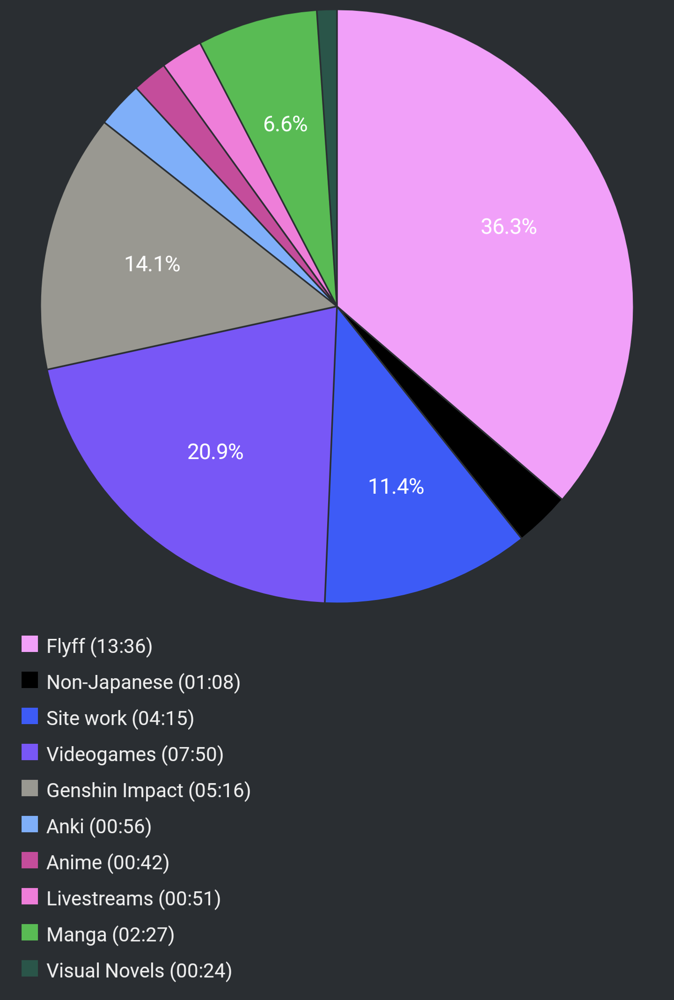

# Report Week 19 Jun - 25 Jun 2022

A lot of varied reading this week, lots of trying out multiple games, but
nothing really worth writing about. For the most part, I'll stick with manga.

## Manga

I read the latest 少年のアビス volume, volume 9. As usual, the story is
absolutely gut wrenching. We get a reunion of our three main characters, with
令児 and チャコ running into 玄 taking shelter at 柴沢先生's place. As is
typical, everybody seems to have their own motives to obsess over 令児 for some
reason, and we get to witness a 900IQ "love" triangle conversation where every
single one of them says one thing and implies something else. Honestly some of
these exchanges are starting to get a bit boring, but in the end we see our
three protagonists manage to escape the clutches of 柴沢先生 and actually make
it to Tokyo! Looks like it was possible to escape that cursed town after all.
Despite all this, however, we still get some drama as 令児 is still getting
strung along by チャコ who now seems wanting to 心中 with him in place of ナギ.
令児 gets stopped by 玄, and we finish the volume with チャコ running away on
her own alone and 令児 goes to meet 似非森先生 who apparently is now very
sickly-looking, in a hospital.

On the other hand, I also read the last volume of 昴とスーさん and I have to
say... it was really meh. I feel like the author didn't know where the story was
going to go since the beginning, and the very final volume felt like they were
just trying to resolve it with 0 plot and just "power of love" kinda bullshit
with 0 explanations. I stuck around because the drawings were good and because
I was intrigued with the whole "age reversal" mystery reason except... we kinda
just get to the end with nothing being explained other than "Oh well, I guess
it got resolved itself. And they lived happily ever after." bullshit. Also I'm
really really not sure how I feel about the whole 30 year old woman dating a
10 year old "kid" that is actually an adult male. Definitely did not enjoy some
of the vibes.

## Pie Chart

Next entry: [[2555157b]]

Previous entry: [[0f9832d9]]

