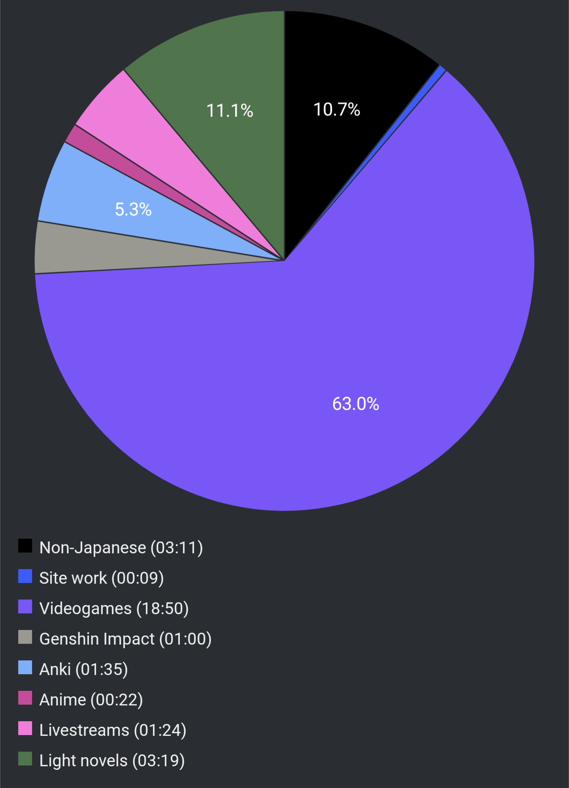

# Report Week 08 May - 14 May 2022

This week I've been focusing more on practicing output and output-related
experiments, so I didn't get quite as much time to read as I would've liked.
It's going to be a short report

## Light Novels

I finally picked 鹿の王 back up from where I left it. I read a couple of long
chapters and I'm now about 55% into the book.

The focus of the narrative for this part of the story has shifted from our
original main character and we're following ホッサル, some kind of doctor, and
his entourage of people investigating this mysterious disease that spread
around the miner labor camp, killing everybody.

We got some general insight on the various relationships between the characters
(most of which I don't recall the names of) but, most importantly, we got some
real interesting tidbits of worldbuilding and background. We learned that our
main character, ヴァン, was the leader of one of the rebellious groups involved
in some battle against the empire. He rode into battle on top of a deer (hence
the title of the book I guess?) and was very bloodthirsty and much feared by the
empire. And obviously, fate has it that ヴァン is the one that gets to survive
after being bitten by the black dogs and escaped the camp, and now ホッサル
and his group have to chase him to be able to find out more about it and attempt
developing a cure.

We also learned that this fated disease, similar to the black plague, had
already spread in the past, 200+ years before, and was the ultimate cause of the
fall of the great kingdom of the past. The breaking of this kingdom led to the
fracturing of the various nations/countries, which later led to the various wars
and conflicts that the empire is now involved in. We'll see where this disease
spreading once again will lead us in this story I guess. I'm excited to read
more.

## Pie Chart

Previous entry: [[727f52cb]]
