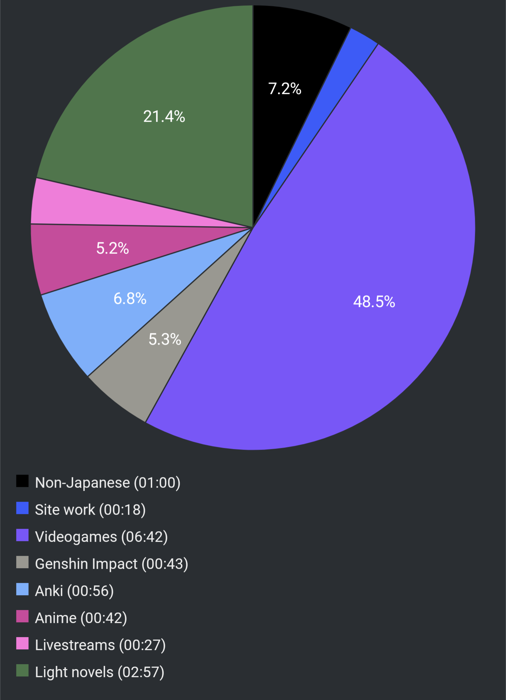

# Report Week 26 Feb ~ 05 Mar 2022

This is my first reading report! Truth be told I only decided to start tracking
what I read and the overall time I spend doing Japanese immersion stuff halfway
through the week so the first report (including time tracking) is going to be a
bit scuffed, but that's just how it is. Starting from next week I'll try to
consistently monitor from Saturday to Saturday my activities, keeping in mind
things I read, games I played, anime I watched, etc.

## Manga

This week I read the latest chapter of ニューノーマル (chapter 17). I have to
say that the way the author deals with the pandemic is quite interesting, and
I enjoy the "romcom" angle despite the darker undertones and overall feeling
that there is *something* going on behind the scenes. This latest chapter
started off with some interesting background of some characters, and then
it diverted back to the typical "teasing" that is hormone-fueled teenage drama
stuff. As always, I just wish these chapters would come out faster or were at
least longer, but I guess that's just a testament of how enjoyable they are to
read.

## Light Novels

I've been recently splitting my time between the 8th volume of
くまクマ熊ベア, and the 1st volume of 終末なにしてますか? 忙しいですか? 救ってもらっていいですか?

Generally I don't enjoy reading multiple books at the same time, however I've
been trying an experiment by reading sukasuka (終末etcetc) on paper (not on
kindle) while listening to the audiobook at the same time. It's quite interesting
because it forces me to just "let go" and keep reading even if I don't understand
some words or sentences. Having the spoken words helps with the kanji readings
and so far the pacing has gone really well, it keeps me focused for longer
periods of time without getting distracted by things like discord or my phone.

For クマ it's the typical stuff... I'm ending this week at about ~60% into the
book as I mostly read it at night before falling asleep. The story is typical
chill with nothing much going on, just your comfy reading before bed. With
sukasuka I am at about ~50% into the volume which is... quite something since I
thought it'd go much slower.

Hopefully I'll be able to finish one of the two (or both) by next week.

## Videogames

Yesterday Triangle Strategy came out and I've been kinda binge-playing it today
(Saturday). The game itself is really nice, reminds me a lot of Final Fantasy
Tactics. There's a lot of political themes with very complicated words and
conversations, which is kinda nice because I'm learning some interesting words
like 塩税, 当主, 公国, etc. Almost all the lines are voiced (aside from some
parts of the town exploration) and overall I'm having a blast. Would recommend
for someone who's at "upper intermediate"/"lower advanced" (whatever that means)
Japanese.

## Pie Chart

As I said above, this stuff has only been tracking the last 2-3 days so it's not
really a full week's time, but it is how it is. Next week we'll get more numbers.

Next entry: [[c226ff5e]]
