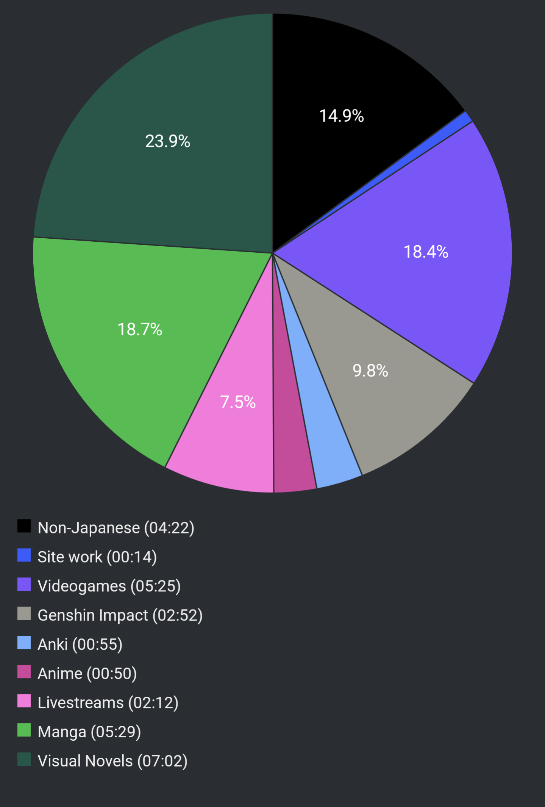

# Report Week 10 Apr - 16 Apr 2022

This week has been a pretty big change in reading habits, as I tend to be very
seasonal flipflopping between novels, manga, videogames, etc. While I'm not a
big fan of Visual Novels (hard to keep my focus on one), I've gone back to them
and so far it's been pretty good.

## Manga

Wew, a lot of manga has been read this week. I've been really into クジラの子ら
and I've read 4 more volumes (from volume 9 to volume 12) and A LOT happened
during these. I'm not even sure I can remember all of it, it feels like I've
read twice the amount of volumes despite being "only" 4. We've seen our main
cast land in アモンロギア, a new island continent, and then get subsequiently
betrayed and captured by ロハリト and his family. To make things worse, the
empire is attacking as well so now we've been thrown into a mixed three-sided
war and we don't know who's who anymore. We are reunited with リコス's brother
which has an obsession with オウニ and the so-called デモナス, he wants to steal
his power and make it his to surprisingly go against the emperor himself and
re-create the world centered around him. Really crazy stuff, and he seems to know
way more than he lets out. In the end he manages to infiltrate アモンロギア and
obtain the power of their goddess, a stone-encased girl who grants him the power
of some sand-based magic thingy which I can't even pronounce. We end the 12th
volume with him capturing a bunch of our main cast: リコス, オウニ, and the 団長,
all the while チャクロ and a bunch of others are left hurt at the mercy of the
アモンロギア soldiers. And on the very last panel we see a huge cliffhanger with
the emperor being someone who looks very much like チャクロ and calls himself a
記録者 just like him. The plot thickens!

## Visual Novel

On the side I've been getting some of my gaming addiction in check with VNs
instead. I've been playing Robotic;Notes and enjoying some steam remote
streaming to my phone in bed which is very comfy. I'm still at the very
beginning and honestly this reminds me why I'm not a fan of VNs in general.
There is SO MUCH padding of content before we manage to get into the proper
story. In all the hours of gameplay I put into it so far I still have no idea
what the story is about, other than the hobby robot-building club is getting
their funds cut due to a lack of members in school (only 2 of them), and that
to prove they are a "proper" club they need to participate in the robot fighting
tournament and win first place, despite not having even a robot ready. So now
they've been scrambling around finding parts and fixing an old robot to use for
the tournament. And this is just mostly some background story, while we've had a
single 3-lines breakout scene with a mysterious android-looking girl saying some
cryptic lines just to keep the audience entertained. I really hope the plots
will pick up pace soon cause I'm already getting bored.

## Pie Chart

Previous entry: [[22d91e84]]

