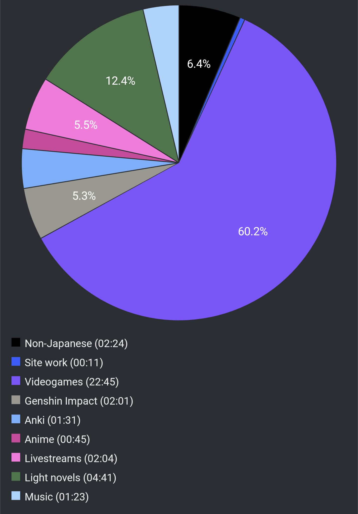

# Report Week 27 Mar - 02 Apr 2022

This week felt like it went at a snail's pace, as I didn't either play as much
videogames, nor read a lot of light novels.

## Videogames

First half of the week I've been playing Ghostwire: Tokyo. It's mostly an action
game so there's not a lot of reading, but there's a lot of references to
Japanese folklore, 妖怪, superstitions, etc. The sidequests are interesting
because they teach you a lot about those things. For example there was one about
a 河童 which taught me the word 尻子玉.

Later in the week I've started playing Scarlet Nexus. I really like the anime
style and the combat is fun. Japanese-wise there's a lot of military-related
words since it involves various military/academy squads so that's nice. It seems
to be a common trope in this kind of Japanese media so I imagine it'll be useful
for later material too.

## Light Novels

Still continuing with 鹿の王. My kindle now reports 35% completion, which is an
increase of 12% since last week. I got introduced to a new character called
ホッサル and I admit it's not quite clear yet if he's a good or a bad guy. I had
to wade through a lot of political exposition since this chapter spent a long
time explaining all kinds of relationships with different nations, countries,
population in general and that was very hard for me to read. Now that I'm past
that, I feel like I will be picking up more pace in no time as the plot has
started to get interesting again.

## Pie Chart

Next entry: [[22d91e84]]

Previous entry: [[a109cca2]]

