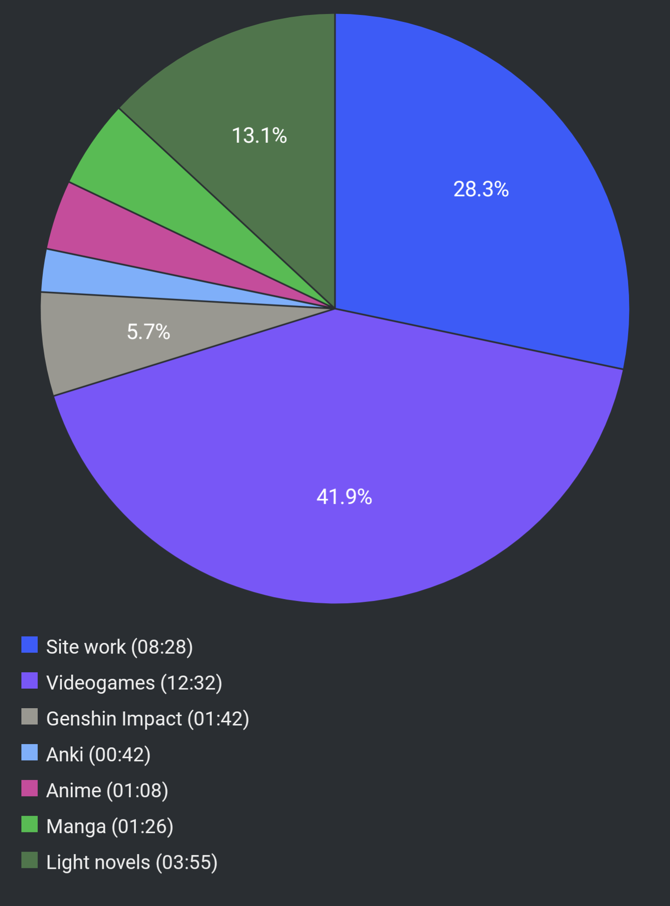

#  Report Week 24 Jul - 30 Jul 2022

## Light Novels

I've been continuing with the 9th volume of Kuma Bear, I'm about 70% done with
it. So far it's been smooth sailing with barely any dictionary lookup. Yuna met
a new elf girl on her way back to her house in the capital, and it turns out to
be the guild master's younger sister. She's reached the capital to inform her
sister that the Elf village's barrier is getting weaker, and she needs her help
in restoring it. Yuna offers to help because she wants to tour around the elf
village as a classic isekai trope, so she tags along with the two sisters on
their way back to the village (which is far away, in a different country). Along
the way, she finds out that the young elf sister sold a very important family
heirloom to get money for the long trip to the capital, and decides to help her
get the heirloom back.

## Manga

On the manga side, I noticed there were two new chapters of ニューノーマル
released (21 & 22) that I had missed, so I jumped straight onto them.
Surprisingly enough, the story is now going towards some actual real plot
development. We get to meet the leader of the "outsider" group of people who are
rebelling against the government and are in support of the pandemic and anti
masks. How topical.

Also Made in Abyss volume 11 finally came out and I started reading it (but
haven't finished it yet, because I've been busy with... see next section). So
far I had missed the feeling of adventure because the なれはて village arc was
honestly kinda boring. But now that riko and her friends are back on foot, I'm
getting excited again. We get to see how Faputa, as the new addition to the
group, interacts with them. She has the ability to talk to the white whistles,
and we get some ominous messages from Riko's mother's whistle. The plot
thickens!

## Videogames

Xenoblade 3 came out yesterday. This is pretty much going to take most of my
immersion time in the near future. I've been binge playing it all day and I have
no plans to do pretty much anything else. The game is gorgeous and the story is
actually really well written so far. The characters feel very realistic in their
interactions despite still being relatively anime tropey. I don't have much to
say about the story as a whole yet but if the narrative keeps consistent with
what I've seen so far, it has the potential of being one of the best JRPG
stories to date (in my book at least).

## Pie Chart

Previous entry: [[3950c23b]]
