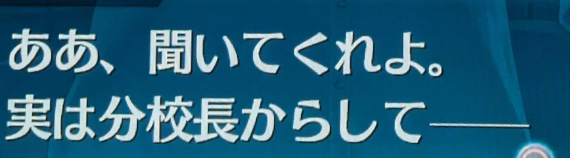

# 聞いてくれよ

This is kind of a ranty phrase not that different from saying "Tell me about it"
in English.

It is used by someone when they want to rant to you about something that
happened to them, and it basically means "Listen to me (rant about this)".

Here's an example from Trails of Cold Steel 3:

The main character is starting to rant to his friend about the 分校長.

