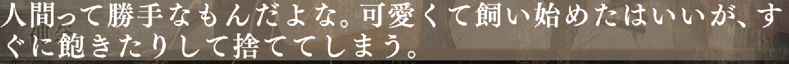

# 〜たはいいが

Normally you cannot put particles straight after verbs, but in old Japanese this
was acceptable and common. There are still remnants of this usage, and you'll
often see things like `<verb>がよい` which is a common (stiff) expression similar
to `<verb>たほうがいい` (sounds very rough/imperative).

However, another common one is using past tense + はいい + が/けど, just like
in this example sentence:

There is a good explanation [on Japanese stack exchange](https://japanese.stackexchange.com/questions/25955/%E3%81%9F%E3%81%AF%E3%81%84%E3%81%84%E3%81%8C-grammar-pattern)
about it.

