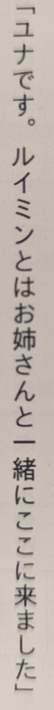

# とは as "with + topic" vs と as "with"

This is a bit tricky to explain and it requires a bit of context to go with it.

Take the following example (picture of actual quote at the end of the page):

`「ユナです。ルイミンとはお姉さんと一緒にここに来ました」`

This is a passage from the light novel くまクマ熊ベアー. The main character ユナ
is traveling with another character called ルイミン. Together, they meet
ルイミン's sister. So, in this case, the group ユナとルイミン is the topic, and
they arrived together with (と) お姉さん.

With と you can do something like 私とあなたとはあのレストランで食べた (You and
I ate at that restaurant) which is equivalent to 私とあなたはあのレストランで食べた.
The last と in the list is omitted.

Likewise, I can say 私はあなたとあのレストランで食べた to mean "I ate with you
at that restaurant". Now if we expand on that, we can have things like
私とあなたは、彼とあのレストランで食べた (You and I ate at that restaurant with
him). If we add the と to 私とあなたは it becomes 私とあなたとは、彼とあのレストランで食べた
which is semantically equivalent.

Now, if we just drop the 私と because it's implied, we get something like
あなたとは彼とあのレストランで食べた. This works pretty much the same as our
example sentence.

私とルイミンとはお姉さんと一緒にここに来ました = Ruimin and I came here with (her)
sister.

