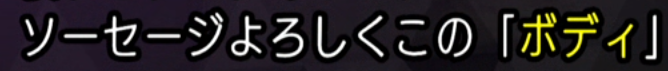

# よろしく as "just like"

It's not super common but there is a meaning of よろしく that often confuses
people the first time they encounter it. It's listed on jisho as
["just like..." or "as though one were..." under meaning 3](https://jisho.org/search/%E3%82%88%E3%82%8D%E3%81%97%E3%81%8F#).

Here's an example from the game Soul Hackers 2:

It basically means "This body just like a sausage" which is actually super
funny.
